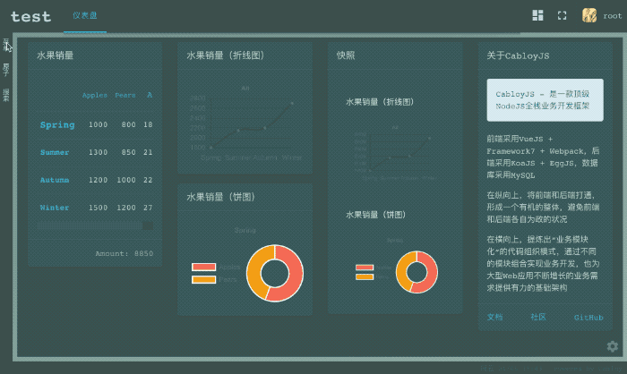
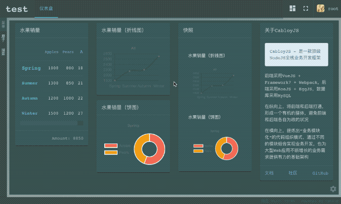
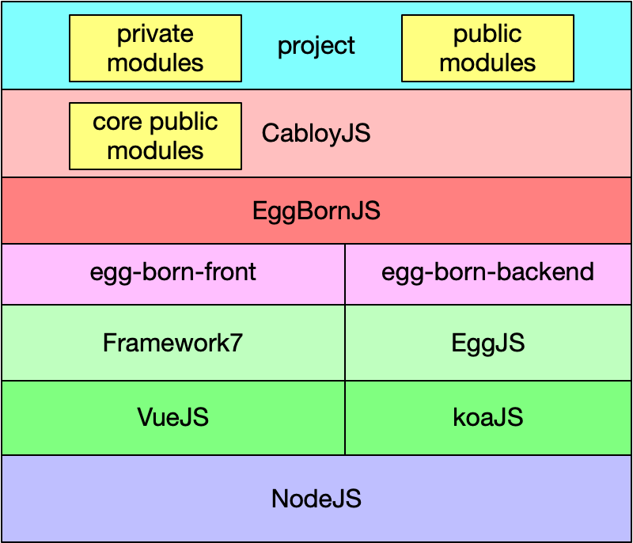
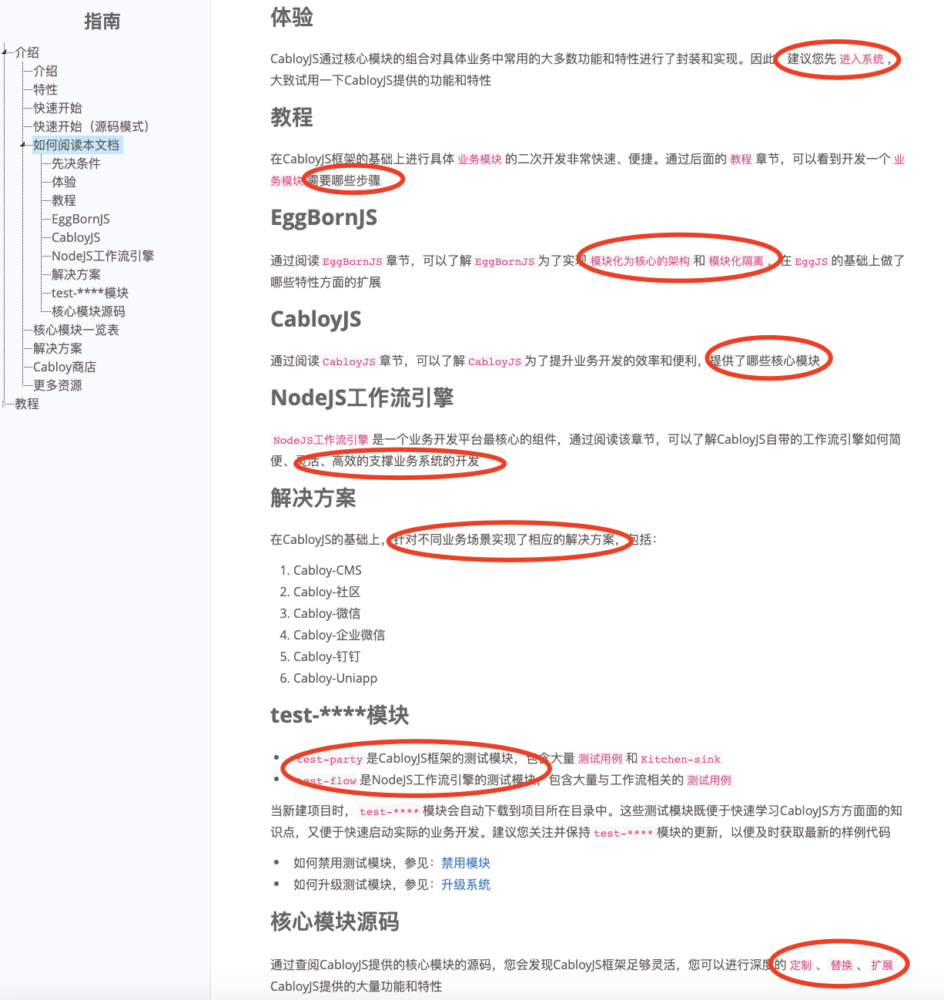
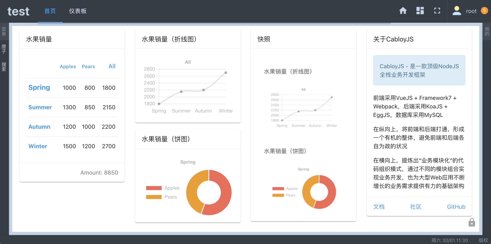
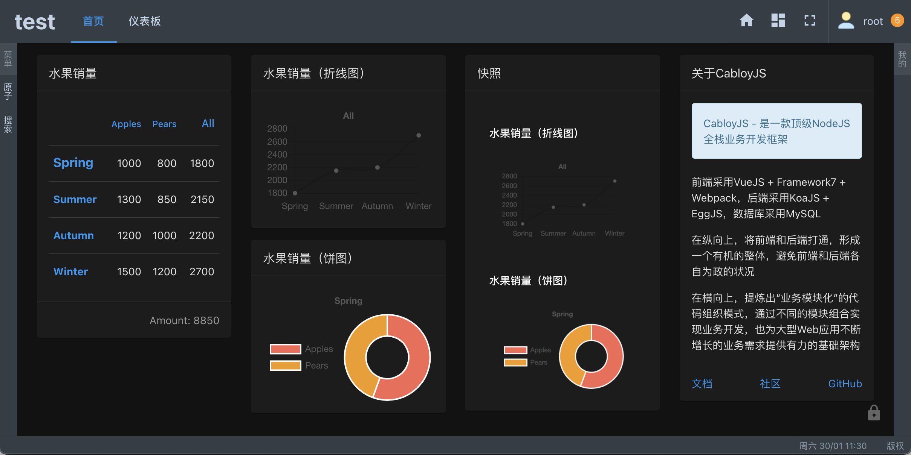
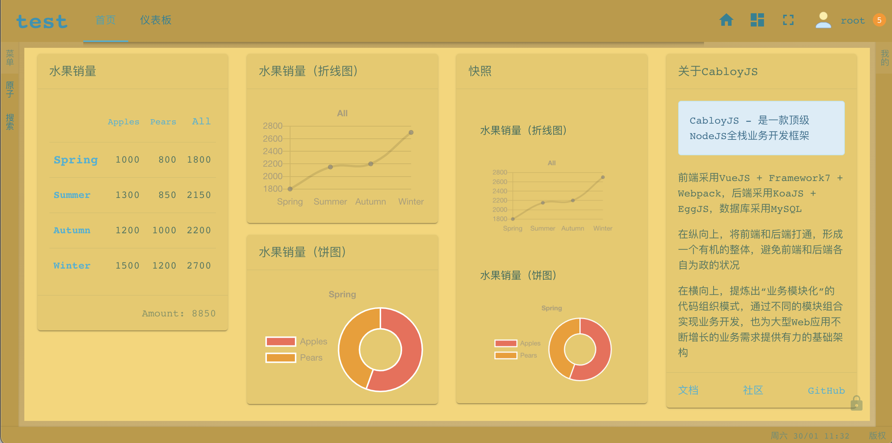
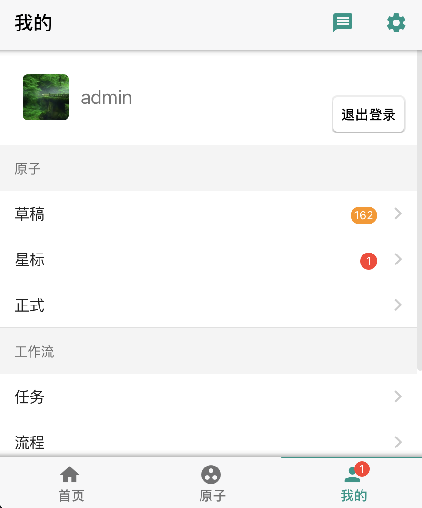

简体中文 | [English](./README.en-US.md)

# CabloyJS：接单快手、创业神器

一款自带工作流引擎的Node.js全栈框架, `接单快手、创业神器`, 基于koa + egg + vue + framework7 + mysql

[![NPM version][npm-image]][npm-url]
[![Unit Test][test-image]][test-url]
[![Test coverage][codecov-image]][codecov-url]
[![David deps][david-image]][david-url]
[![NPM download][download-image]][download-url]

[npm-image]: https://img.shields.io/npm/v/cabloy.svg?style=flat-square
[npm-url]: https://npmjs.org/package/cabloy
[test-image]: https://github.com/zhennann/cabloy/workflows/actions-unittest/badge.svg
[test-url]: https://github.com/zhennann/cabloy/actions
[codecov-image]: https://img.shields.io/codecov/c/github/zhennann/cabloy.svg?style=flat-square
[codecov-url]: https://codecov.io/gh/zhennann/cabloy
[david-image]: https://img.shields.io/david/zhennann/cabloy.svg?style=flat-square
[david-url]: https://david-dm.org/zhennann/cabloy
[download-image]: https://img.shields.io/npm/dm/cabloy.svg?style=flat-square
[download-url]: https://npmjs.org/package/cabloy

## 文档

- [官网 && 文档](https://cabloy.com)

## 在线演示

|场景|链接/二维码|
|--|--|
|PC端|https://test.cabloy.com/|
|Mobile端||

|账号类型|名称|密码|
|--|--|--|
|管理员|admin|123456|
|普通用户|tom|123456|
|普通用户|jane|123456|

## 谁会用这款Node.js全栈框架？

### >>>>> 0. 场景画像

小王准备创业，需要开发一款多租户的SAAS业务系统，想请小明帮忙，希望能用有限的预算让系统尽快落地，以便尽早验证商业模型，从而控制创业的风险

小明原本在公司里做开发，由于公司有完整的技术团队做支撑，做项目还是比较顺利。但是，当小明独立面对这样一个需求时，发现原本在公司使用的技术栈用不上了

这时候，小明就希望能找到一个`全栈业务开发框架`，内置各种功能特性，既开箱即用，又方便二次开发、灵活定制。在此基础上进行业务的快速开发，从而能保质保量的为朋友创业助一把力

### >>>>> 1. 外包接单

`痛点`：

客户希望项目按质如期完工、价格低、风险小；服务商希望毛利高、投入少、进度快、客户满意。如何实现二者的平衡呢？

如果接到项目，从零开始代码开发，就会放大客户与服务商之间的矛盾，增大项目的实施风险。因此，一款高质、高效、灵活的全栈框架，可以让`外包接单`之路走得更顺一些，更远一些

`优点`：

1. `高效灵活`：CabloyJS历时5年精心打造的Node.js全栈框架，内置大量特性功能，开箱即用，同时又具有强大的可扩展性，便于定制开发
2. `二次机会`：CabloyJS完善的基础建设，不仅让开发效率更高，而且可以引导和培育客户的日常操控体验，从而衍生出更多的业务需求和合作机会

### >>>>> 2. 初创企业

`诉求`：

在创业成本高企、竞争越发激烈的今天，初创企业往往希望在尽短的时间、以尽少的成本，研发出`最小可用产品（MVP）`，从而尽早发布测试、收集反馈、迭代优化

`优点`：

1. `尽快落地`：CabloyJS采用模块化体系，支持全场景开发，确保MVP产品尽快落地
2. `保值`：CabloyJS从底层内置分布式设计，并且内置工作流引擎等核心特性。当系统起量之后可以无缝支持集群部署，并在MVP产品的基础上继续深入开发更核心的业务，从而达到`保值`的效果
3. `增值`：CabloyJS提供了`模块市场`，可以通过`模块市场`直接选购与自身业务需求相匹配的模块，以低成本快速实现业务需求，从而达到`增值`的效果

## CabloyJS可以开发什么系统

1. 可以开发`多租户SAAS业务系统`
2. 可以开发前后端分离的`后台业务管理系统`，如OA、CRM、ERP、电商，等等
3. 可以开发`JAMStack`架构的`CMS内容管理系统`，支持SEO优化，如博客、技术文档、社区、知识店铺，等等
4. 既可以先开发`后台业务管理系统`，再延伸开发`CMS内容管理系统`；也可以反过来，先开发`CMS内容管理系统`，再延伸开发`后台业务管理系统`
5. 可以通过`Cordova`开发各类App应用，支持IOS、Android
6. 可以通过`Electron`开发桌面应用
7. 可以开发微信公众号、企业微信、钉钉，等第三方平台的应用，解决`信息孤岛`的问题
8. 可以为`Uniapp小程序`开发后端API接口

## CabloyJS的商业模式

1. `开源免费`：CabloyJS全栈框架，开源免费，并提供大量文档、测试模块、视频课程等资源
2. `模块市场`：CabloyJS提供了`模块市场`。研发同仁可以在实际开发过程中不断沉淀通用的模块，发布到`模块市场`，与平台共享收益。从而成为外包接单之外的`睡后收入`，共同打造一个由`线性生长`向`指数生长`的通道
3. `二级分销`：`模块市场`导入`二级分销`的玩法，汇聚更多社会渠道资源，带动模块的销售

CabloyJS先期制作了一套视频课程，导入了相同的`二级分销`的玩法，欢迎品鉴

`相关链接`：

- [关于二级分销](https://course.cabloy.com/zh-cn/articles/about-fenxiao.html)

## CabloyJS的四大亮点

### >>>>> 亮点1：自适应布局：`pc = mobile + pad`

1. **背景说明**

> 对于前端开发而言，有一个很现实的问题：如何同时进行pc端和mobile端的开发？

传统的做法一般而言有两个：

1）**采用`css自适应媒体查询`**

由于原生mobile端的布局和pc端的布局是不同的。`css自适应媒体查询`只是让pc端的页面在mobile端可用，但达不到`原生mobile端`的效果

比如，许多使用`bootstrap`实现的博客；再比如，市面上绝大多数`后台管理系统模版`。往往优先处理pc端的显示效果，然后采用`css自适应媒体查询`来适配mobile端，从而在mobile端仅仅达到能看的程度，但绝对不好用

2）**采用两套代码**

由于采用`css自适应媒体查询`有很大的局限性，很多项目采用`两套代码`来分别处理`pc端`和`mobile端`的布局显示。这样虽然解决了问题，但是同样的业务逻辑需要做两套代码，成本、时间、精力都得翻倍

2. **解决之道：`pc = mobile + pad`自适应布局**

CabloyJS首创`pc = mobile + pad`的自适应布局机制：只需要一套代码，`mobile端`达到原生效果，同时将`mobile端`的操控体验和开发模式无缝带入`pc端`

* `效果演示`：进入演示网站[https://test.cabloy.com/](https://test.cabloy.com/)，然后调整窗口尺寸分别体验pc端和mobile端的效果

* `pc端`：

* `mobile端`：

### >>>>> 亮点2：模块化开发体系与模块隔离

1. **模块化体系**：CabloyJS采用`模块思维`规划系统架构，以业务功能为单位，将与业务功能相关的前端组件与后端逻辑组织为一个`业务模块`，有利于业务功能的内聚与重用，从而便于沉淀通用的模块，然后发布到`模块市场`
2. **模块隔离**：模块的页面、数据、逻辑、路由、配置等元素均进行了命名空间隔离处理，避免模块之间的变量污染与冲突
3. **全局模块与局部模块**：CabloyJS内置了大量`全局模块`，提供`工作流引擎`、`用户管理`、`角色管理`、`权限管理`、`菜单管理`、`参数设置管理`、`表单验证`、`登录机制`，等等诸多特性。具体的业务开发则在`局部模块`中进行，架构清晰、层次分明，从而轻松应对业务规模的持续增长

### >>>>> 亮点3：前后端分离，全场景开发

通过前后端分离的架构设计，可以支持全场景业务的快速开发

|场景|前端|后端|
|--|--|--|
| PC：Web | CabloyJS前端 |CabloyJS后端|
| PC：Exe | CabloyJS前端 + Electron |CabloyJS后端|
| Mobile：IOS | CabloyJS前端 + Cordova |CabloyJS后端|
| Mobile：Android | CabloyJS前端 + Cordova |CabloyJS后端|
|微信公众号| CabloyJS前端 + 微信API |CabloyJS后端|
|企业微信| CabloyJS前端 + 企业微信API |CabloyJS后端|
| 钉钉 | CabloyJS前端 + 钉钉API |CabloyJS后端|
| Slack | CabloyJS前端 + Slack API |CabloyJS后端|
| 小程序：微信、支付宝等 |Uni-app + CabloyJS前端SDK |CabloyJS后端|

* `后端`：由于完整的前后端分离设计，只需开发一套CabloyJS后端代码即可
* `前端`：所有可基于H5的场景，只需开发一套CabloyJS前端代码即可
* `小程序`：提供CabloyJS前端SDK让Uni-app可以轻松对接CabloyJS后端代码

### >>>>> 亮点4：内置NodeJS工作流引擎

众所周知，NodeJS作为后端开发语言和运行环境，支持高并发、开发效率高，有口皆碑，但是大多用于`数据CRUD管理`、`中间层聚合`和`中间层代理`等工具场景，很少深入到业务领域的核心。有许多采用NodeJS开发的`最小可用产品（MVP）`最终会另起炉灶重构，这是原因之一

究其根源，NodeJS作为业务开发平台，还缺少许多核心的基础构件，`NodeJS工作流引擎`便是其一。CabloyJS 4.0重点开发了NodeJS工作流引擎，并作为内置的基础核心模块（同样是开源、免费），近一步拓展了NodeJS在后端的应用场景，为深入研发各类商业业务逻辑，提供了基础支撑

## CabloyJS的研发历程

CabloyJS从2016年启动开发，主要历经两个研发阶段：

### 1. 第一阶段：EggBornJS

EggBornJS关注的核心就是`模块化体系`与`模块隔离`，并以此实现一套完整的全栈开发框架

比如模块`egg-born-front`是框架前端的核心模块，模块`egg-born-backend`是框架后端的核心模块，模块`egg-born`是框架的命令行工具，用于创建项目骨架

> 这也是为什么所有业务模块都是以`egg-born-module-`为命名前缀的原因

### 2. 第二阶段：CabloyJS

EggBornJS只是一个基础的全栈开发框架，如果要支持业务的快速开发，还需要考虑许多与业务相关的支撑特性，如：`工作流引擎`、`用户管理`、`角色管理`、`权限管理`、`菜单管理`、`参数设置管理`、`表单验证`、`登录机制`，等等。特别是在前后端分离的场景下，对`权限管理`的要求就提升到一个更高的水平

CabloyJS在EggBornJS的基础上，提供了一套核心业务模块，从而实现了一系列业务支撑特性，并将这些特性进行有机的组合，形成完整而灵活的上层生态架构，从而支持具体的业务开发进程

> 有了EggBornJS，从此可复用的不仅仅是组件，还有业务模块

> 有了CabloyJS，您就可以快速开发各类业务应用

## CabloyJS架构图与技术栈

### 1. 第一层：NodeJS

基于NodeJS，从而使得前后端均可以采用Javascript语言进行全栈开发，从而显著提升开发效率

### 2. 第二层：VueJS、KoaJS

### 3. 第三层：Framework7、EggJS

* `前端`：采用Framework7作为主体的UI组件库，同时根据业务需要搭配其他UI组件库，如AntD Vue的表格组件、AntV X6工作流绘制组件、ChartJS图表组件，等等
* `后端`：采用EggJS作为底层框架，从而沿用了EggJS成熟的基础建设和丰富的插件生态

### 4. 第四层：egg-born-front、egg-born-backend

* `egg-born-front`：是前端的核心模块，主要进行了以下几方面的工作：

1. **模块前端隔离**：对模块前端的页面、数据、逻辑、路由、配置等元素进行了命名空间隔离处理，避免模块之间的变量污染与冲突
2. **模块加载机制**：只需给模块名称增加一个`sync`后缀，即可实现模块的`同步加载`和`异步加载`，参见：[加载机制](https://cabloy.com/zh-cn/articles/3b1a0aeb1440499bac33a9823e425d57.html#_43)
3. **pc=mobile+pad自适应布局**：对Framework7进行了改造，只需要一套代码，`mobile端`达到原生效果，同时将`mobile端`的操控体验和开发模式无缝带入`pc端`，参见[自适应布局：pc = mobile + pad](https://cabloy.com/zh-cn/articles/adaptive-layout.html)
4. **组件环境对象**：向Vue组件实例注入了大量环境对象，方便开发，参见：[Component](https://cabloy.com/zh-cn/articles/6234d0ad3bbe4c1cb83d4b556f894eb5.html)

* `egg-born-backend`：是后端的核心模块，主要进行了以下几方面的工作：

1. **模块化开发体系**：EggJS原有的目录结构并不适合模块化的开发风格。但是EggJS提供了强大的扩展机制，允许提供自定义的Loader加载器。通过开发自定义的Loader加载器，实现了以业务模块为单元的目录结构。每个业务模块可以定义与自身业务相关的资源，如：`Routes、Controllers、Services、Models、Middlewares、Config、i18n语言资源`，等等。而且这些元素可以`编译打包`成一个js文件，同时也可以进行`丑化`，从而`保护商业代码`。由于这种模块化的开发体系，也方便把编译打包的模块直接发布到`NPM仓库`或者`模块市场`，与社区分享，参见：[模块编译与发布](https://cabloy.com/zh-cn/articles/beef7cd0ab0a495284797a5af933a155.html)
2. **模块后端隔离**：以自定义的Loader加载器为基础，对模块后端的`Routes、Controllers、Services、Models、Config`等元素进行了命名空间隔离处理，避免模块之间的变量污染与冲突
3. **Bean容器与AOP编程**：基于原生JS（Vanilla JS）实现了更轻量、更灵活的Bean容器，并可以通过AOP机制进行扩展，参见：[Bean](https://cabloy.com/zh-cn/articles/bean.html)
3. **原生分布式架构**：EggJS原有的`Worker + Agent`进程模型，对于单机而言非常便利。但是面对多机集群，特别是基于`docker`的集群部署而言，`Agent进程`就失去了用武之地。更重要的是，如果一开始基于`Agent进程`进行开发，后续很难平滑的过渡到分布式场景。因此，`egg-born-backend`采用`Redis`，从框架底层就开始原生分布式的架构设计，并衍生出了`Broadcast、Queue、Schedule、Startup`等一系列分布式的开发组件，方便我们从一开始就进行分布式的开发。因此当系统起量后，可以轻松做集群扩展，参见：[Broadcast](https://cabloy.com/zh-cn/articles/broadcast.html), [Queue](https://cabloy.com/zh-cn/articles/queue.html), [Schedule](https://cabloy.com/zh-cn/articles/schedule.html), [Startup](https://cabloy.com/zh-cn/articles/startup.html)

### 5. 第五层：EggBornJS

`egg-born-front`和`egg-born-backend`，再加上一些周边工具，共同构成了EggBornJS，也就是CabloyJS研发历程的第一阶段

### 6. 第六层：CabloyJS

CabloyJS在EggBornJS的基础上，研发了一套`核心全局模块`，实现了一系列业务支撑特性，并将这些特性进行有机的组合，形成完整而灵活的上层生态架构，从而支持具体的业务开发进程

### 7. 第七层：Project（项目）

实际的项目由`全局模块`和`局部模块`构成

* `全局模块`：CabloyJS内置的核心模块、来自`NPM仓库`或者`模块市场`的第三方模块，统称为`全局模块`，一般安装在`node_modules`目录
* `局部模块`：项目实际的开发工作一般在`局部模块`中展开。`局部模块`位于项目目录内，参见：[新建模块](https://cabloy.com/zh-cn/articles/module-create.html)

## 信念

> 凡是可以用JavaScript来写的应用，最终都会用JavaScript来写 | Atwood定律

相信，Javascript的深度探索者都会被这句名言激发，共同努力，为Javascript生态添砖加瓦，构建更繁荣的应用生态

CabloyJS正是对这一名言的探索之作。欢迎您也加入CabloyJS的社区生态，一起促进Javascript的繁荣与应用

## 名称的由来

### 1. EggBorn

这个名称的由来比较简单，因为有了Egg(后端框架)，所以就有了EggBorn。有一部动画片叫《天书奇谭》，里面的萌主就叫“蛋生”，我很喜欢看（不小心暴露了年龄😅）

### 2. Cabloy

Cabloy来自蓝精灵的魔法咒语，拼对了Cabloy这个单词就会有神奇的效果。同样，CabloyJS是有关化学的魔法，基于模块的组合与生化反应，您将实现您想要的任何东西

## CabloyJS开发的正式系统

|网站类型|网站链接|
|--|--|
|后台管理系统（PC布局）|[https://admin.cabloy.com](https://admin.cabloy.com)|
|后台管理系统（Mobile布局）||
|||
|博客|[https://zhennann.com](https://zhennann.com)|
|技术文档（英文）|[https://cabloy.com/index.html](https://cabloy.com/index.html)|
|技术文档（中文）|[https://cabloy.com/zh-cn/index.html](https://cabloy.com/zh-cn/index.html)|
|社区（英文）|[https://community.cabloy.com/index.html](https://community.cabloy.com/index.html)|
|社区（中文）|[https://community.cabloy.com/zh-cn/index.html](https://community.cabloy.com/zh-cn/index.html)|
|课程（英文）|[https://course.cabloy.com/index.html](https://course.cabloy.com/index.html)|
|课程（中文）|[https://course.cabloy.com/zh-cn/index.html](https://course.cabloy.com/zh-cn/index.html)|
|Cabloy商店（英文）|[https://store.cabloy.com/index.html](https://store.cabloy.com/index.html)|
|Cabloy商店（中文）|[https://store.cabloy.com/zh-cn/index.html](https://store.cabloy.com/zh-cn/index.html)|

## 部分特性摘要

### >>>>> 第一部分: 基础功能

- [Bean & AOP](https://cabloy.com/zh-cn/articles/bean.html)
  1. 几乎所有事物都是Bean
  2. Bean支持AOP
  3. AOP也是一种Bean
- 基于`Redis`的分布式集群框架

  CabloyJS通过`Redis`从框架底层就开始原生支持分布式，因此当系统起量后，可以轻松做集群扩展
  - [Broadcast](https://cabloy.com/zh-cn/articles/broadcast.html)
  - [Queue](https://cabloy.com/zh-cn/articles/queue.html)
  - [Schedule](https://cabloy.com/zh-cn/articles/schedule.html)
  - [Startup](https://cabloy.com/zh-cn/articles/startup.html)
- [前后端分离](https://cabloy.com/zh-cn/articles/f66dc04c64ca43fa9e8ea30312ca714f.html)
- I18N
  - [后端](https://cabloy.com/zh-cn/articles/f6d5a48f10dc40d3b8aed7862c23570b.html)
  - [前端](https://cabloy.com/zh-cn/articles/1c7c9cf3861744c2a63ae134076c652f.html)
- [主题](https://cabloy.com/zh-cn/articles/theme.html)
- [多租户/多域名/多实例](https://cabloy.com/zh-cn/articles/44e45b3928ca4c6cb63809558145e000.html)
- [测试驱动开发](https://cabloy.com/zh-cn/articles/990962d4e3604fc099c27806de6d6be8.html)

### >>>>> 第二部分: 业务功能

- [NodeJS工作流引擎](https://cabloy.com/zh-cn/articles/flow-introduce.html)

  众所周知，NodeJS作为后端开发语言和运行环境，样样都好，就差一个`NodeJS工作流引擎`。CabloyJS 4.0重点开发了`NodeJS工作流引擎`，并作为内置的基础核心模块，近一步拓展了NodeJS在后端的应用场景，为深入研发各类商业业务逻辑，提供了基础支撑
- [自适应布局: pc = mobile + pad](https://cabloy.com/zh-cn/articles/adaptive-layout.html)

  CabloyJS首创`pc = mobile + pad`的自适应布局机制：只需要一套代码，`mobile端`达到原生效果，同时将`mobile端`的操控体验和开发模式无缝带入`pc端`
- 拖拽
  - [移动](https://cabloy.com/zh-cn/articles/dragdrop-move.html)
  - [调整尺寸](https://cabloy.com/zh-cn/articles/dragdrop-resize.html)
- [仪表板](https://cabloy.com/zh-cn/articles/5c90f4fd15174772adb34dfbf6d1adfb.html)
- [PC布局](https://cabloy.com/zh-cn/articles/28f14f839af5457b9243c9e9210d5324.html)
- [统一数据管理](https://cabloy.com/zh-cn/articles/atom-basic.html)
- [统一用户角色权限管理](https://cabloy.com/zh-cn/articles/535f42e8fb8c487fb33b88c9a9e56a7e.html)
- [明细数据管理](https://cabloy.com/zh-cn/articles/detail-basic.html)
- Socket IO
  - 统计值自动更新、自动推送机制
  - [进度条](https://cabloy.com/zh-cn/articles/10327f8fdae44d87b7604ba3fa9c1a89.html)
- [内置大量核心模块](https://cabloy.com/zh-cn/articles/e678d328cb5b4efdaf5d60c8df1ca691.html)

### >>>>> 第三部分: 解决方案

由于CabloyJS提供了大量的前端组件和后端特性，使得开发具体场景的业务也变得非常方便、流畅。CabloyJS仍然通过提供不同的`业务模块`来支援不同的业务场景开发

目前，CabloyJS提供了以下业务场景的解决方案

|名称|说明|
|--|--|
|[Cabloy-CMS](https://cabloy.com/zh-cn/articles/cms-introduce.html)|`动静结合(即JAMStack模式)`的CMS，可以快速构建`企业网站`、`博客`、`技术文档`、`社区`、`商城`等Web应用|
|[Cabloy-Community](https://cabloy.com/zh-cn/articles/community-introduce.html)|基于Cabloy-CMS开发的社区（论坛）Web应用|
|[Cabloy-微信](https://cabloy.com/zh-cn/articles/wechat-introduce.html)|`微信接口模块`，当前整合了`微信公众号`、`微信Web登录`和`微信小程序`的接口，达到`开箱即用`的使用效果。在`Cabloy-微信`的基础上，可以很方便的开发各类微信业务系统|
|[Cabloy-企业微信](https://cabloy.com/zh-cn/articles/wxwork-introduce.html)|`企业微信接口模块`，当前整合了`自建应用`和`企业微信小程序`的接口，达到`开箱即用`的使用效果。在`Cabloy-企业微信`的基础上，可以很方便的开发各类企业微信业务系统|
|[Cabloy-钉钉](https://cabloy.com/zh-cn/articles/dingtalk-introduce.html)|`钉钉接口模块`，当前整合了`H5微应用`和`钉钉小程序`的接口，达到`开箱即用`的使用效果。在`Cabloy-钉钉`的基础上，可以很方便的开发各类钉钉业务系统|
|[Cabloy-Uniapp](https://cabloy.com/zh-cn/articles/uniapp-introduce.html)|`Cabloy-Uniapp`专门为`Uniapp`应用提供了一套量身定制的`前端SDK`，用于便捷的访问CabloyJS提供的所有API接口，让`Uniapp`前端开发再无`后顾之忧`|

## 资源

### - 英文版

- [CabloyJS Store](https://store.cabloy.com/index.html)
- [CabloyJS Courses](https://course.cabloy.com/index.html)
- [CabloyJS Community](https://community.cabloy.com/index.html)
- [CabloyJS Awesome](./docs/awesome.md)

### - 中文版

- [CabloyJS 商店](https://store.cabloy.com/zh-cn/index.html)
- [CabloyJS 课程](https://course.cabloy.com/zh-cn/index.html)
- [CabloyJS 社区](https://community.cabloy.com/zh-cn/index.html)
- [CabloyJS Awesome](./docs/awesome.zh-CN.md)

### - CabloyJS官方交流群

请添加个人微信，联系加群，备注：`加群`

  

### - 图片

一图胜千言: [如何阅读本文档](https://cabloy.com/zh-cn/articles/how-to-read.html)

  

## 预览

- 白色主题

- 暗色主题

- 风信子主题

- 灿烂主题

- 显示侧边栏

- 移动端风格

## License

[MIT](./LICENSE)
