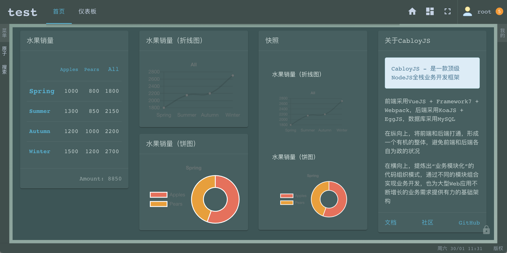
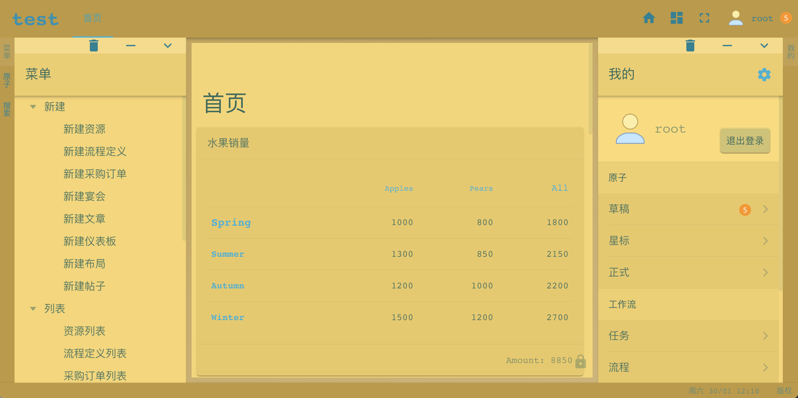

简体中文 | [English](./README.en-US.md)

# CabloyJS：接单快手、创业神器

一款自带工作流引擎的Node.js全栈框架, `接单快手、创业神器`, 基于koa + egg + vue + framework7 + mysql

[![NPM version][npm-image]][npm-url]
[![Unit Test][test-image]][test-url]
[![Test coverage][codecov-image]][codecov-url]
[![David deps][david-image]][david-url]
[![NPM download][download-image]][download-url]

[npm-image]: https://img.shields.io/npm/v/cabloy.svg?style=flat-square
[npm-url]: https://npmjs.org/package/cabloy
[test-image]: https://github.com/zhennann/cabloy/workflows/actions-unittest/badge.svg
[test-url]: https://github.com/zhennann/cabloy/actions
[codecov-image]: https://img.shields.io/codecov/c/github/zhennann/cabloy.svg?style=flat-square
[codecov-url]: https://codecov.io/gh/zhennann/cabloy
[david-image]: https://img.shields.io/david/zhennann/cabloy.svg?style=flat-square
[david-url]: https://david-dm.org/zhennann/cabloy
[download-image]: https://img.shields.io/npm/dm/cabloy.svg?style=flat-square
[download-url]: https://npmjs.org/package/cabloy

## 文档

- [官网 && 文档](https://cabloy.com)

## 在线演示

|场景|链接/二维码|
|--|--|
|PC端|https://test.cabloy.com/|
|Mobile端||

|账号类型|名称|密码|
|--|--|--|
|管理员|admin|123456|
|普通用户|tom|123456|
|普通用户|jane|123456|

## 谁会用这款Node全栈框架？

### 1. 外包接单

`痛点`：

客户希望项目按质如期完工、价格低、风险小；服务商希望毛利高、投入少、进度快、客户满意。如何实现二者的平衡呢？

如果接到项目，从零开始代码开发，就会放大客户与服务商之间的矛盾，增大项目的实施风险。因此，一款高质、高效、灵活的全栈框架，可以让`外包接单`之路走的更顺一些，更远一些

`优点`：

1. 高效灵活：CabloyJS历时5年打造的Node全栈框架，内置大量特性功能，开箱即用，同时又具有强大的可扩展性，便于定制开发
2. 二次机会：CabloyJS完善的基础建设，不仅让开发效率更高，而且可以引导客户，衍生出更多的业务需求和合作机会

### 2. 初创企业

`诉求`：

在创业成本高企、竞争越发激烈的今天，初创企业往往希望在尽短的时间、以尽少的成本，研发出`最小可用产品（MVP）`，从而尽早发布测试、收集反馈、迭代优化

`优点`：

1. 尽快落地：CabloyJS采用模块化体系，支持全场景开发，确保MVP产品尽快落地
2. 保值：CabloyJS从底层内置分布式设计，并且内置工作流引擎等核心特性。当系统起量之后可以无缝支持集群部署，并在MVP产品的基础上继续深入开发更核心的业务，从而达到`保值`的效果
3. 增值：CabloyJS提供了`模块市场`，可以通过`模块市场`直接选购与自身业务需求相匹配的模块，以低成本快速实现业务需求，从而达到`增值`的效果

## CabloyJS的商业模式

1. 开源免费：CabloyJS全栈框架，开源免费，并提供大量文档、测试模块、视频课程等资源
2. 模块市场：CabloyJS提供了`模块市场`。研发同仁可以在实际开发过程中不断沉淀通用的模块，发布到`模块市场`，与平台共享收益
3. 二级分销：`模块市场`导入`二级分销`的玩法，汇聚更多社会渠道资源，带动模块的销售

CabloyJS先期制作了一套视频课程，导入了相同的`二级分销`的玩法

`相关链接`：

- [关于课程](https://course.cabloy.com/zh-cn/articles/about-course.html)
- [关于框架](https://course.cabloy.com/zh-cn/articles/about-cabloyjs.html)
- [关于二级分销](https://course.cabloy.com/zh-cn/articles/about-fenxiao.html)

## CabloyJS的四大亮点

### 亮点1：自适应布局：`pc = mobile + pad`

1. 背景说明

> 对于前端开发而言，有一个很现实的问题：如何同时进行pc端和mobile端的开发？

传统的做法一般而言有两个：

1）采用`css自适应媒体查询`

由于原生mobile端的布局和pc端的布局是不同的。`css自适应媒体查询`只是让pc端的页面在mobile端可用，但达不到`原生mobile端`的效果

比如，许多使用`bootstrap`实现的博客；再比如，市面上绝大多数`后台管理系统模版`。往往优先处理pc端的显示效果，然后使用`css自适应媒体查询`来适配mobile端，从而在mobile端仅仅达到能看的程度，但绝对不好用

2）采用两套代码

由于采用`css自适应媒体查询`有很大的局限性，很多项目采用`两套代码`来分别处理`pc端`和`mobile端`的布局显示。这样虽然解决了问题，但是同样的业务逻辑需要做两套代码，成本、时间、精力都是加倍

2. 解决之道：`pc = mobile + pad`自适应布局

CabloyJS首创`pc = mobile + pad`的自适应布局机制：只需要一套代码，`mobile端`达到原生效果，同时将`mobile端`的操控体验和开发模式无缝带入`pc端`

> 效果演示：进入演示网站[https://test.cabloy.com/](https://test.cabloy.com/)，然后调整窗口尺寸分别体验pc端和mobile端的效果

### 亮点2：模块化开发体系

### 亮点3：前后端分离，全场景开发

### 亮点4：内置NodeJS工作流引擎

## 目标、历史、信念

- [关于CabloyJS](https://cabloy.com/zh-cn/articles/introduce.html)

## CabloyJS开发的正式系统

|网站类型|网站链接|
|--|--|
|后台管理系统（PC布局）|[https://admin.cabloy.com](https://admin.cabloy.com)|
|后台管理系统（Mobile布局）||
|||
|博客|[https://zhennann.com](https://zhennann.com)|
|技术文档（英文）|[https://cabloy.com/index.html](https://cabloy.com/index.html)|
|技术文档（中文）|[https://cabloy.com/zh-cn/index.html](https://cabloy.com/zh-cn/index.html)|
|社区（英文）|[https://community.cabloy.com/index.html](https://community.cabloy.com/index.html)|
|社区（中文）|[https://community.cabloy.com/zh-cn/index.html](https://community.cabloy.com/zh-cn/index.html)|
|Cabloy商店（英文）|[https://store.cabloy.com/index.html](https://store.cabloy.com/index.html)|
|Cabloy商店（中文）|[https://store.cabloy.com/zh-cn/index.html](https://store.cabloy.com/zh-cn/index.html)|

## 特性

### - 第一部分: 基础功能

- [Bean & AOP](https://cabloy.com/zh-cn/articles/bean.html)
  1. 几乎所有事物都是Bean
  2. Bean支持AOP
  3. AOP也是一种Bean
- 基于`Redis`的分布式集群框架

  CabloyJS通过`Redis`从框架底层就开始原生支持分布式，因此当系统起量后，可以轻松做集群扩展
  - [Broadcast](https://cabloy.com/zh-cn/articles/broadcast.html)
  - [Queue](https://cabloy.com/zh-cn/articles/queue.html)
  - [Schedule](https://cabloy.com/zh-cn/articles/schedule.html)
  - [Startup](https://cabloy.com/zh-cn/articles/startup.html)
- [前后端分离](https://cabloy.com/zh-cn/articles/f66dc04c64ca43fa9e8ea30312ca714f.html)
- I18N
  - [后端](https://cabloy.com/zh-cn/articles/f6d5a48f10dc40d3b8aed7862c23570b.html)
  - [前端](https://cabloy.com/zh-cn/articles/1c7c9cf3861744c2a63ae134076c652f.html)
- [主题](https://cabloy.com/zh-cn/articles/theme.html)
- [多租户/多域名/多实例](https://cabloy.com/zh-cn/articles/44e45b3928ca4c6cb63809558145e000.html)
- [测试驱动开发](https://cabloy.com/zh-cn/articles/990962d4e3604fc099c27806de6d6be8.html)

### - 第二部分: 业务功能

- [NodeJS工作流引擎](https://cabloy.com/zh-cn/articles/flow-introduce.html)

  众所周知，NodeJS作为后端开发语言和运行环境，样样都好，就差一个`NodeJS工作流引擎`。CabloyJS 4.0重点开发了`NodeJS工作流引擎`，并作为内置的基础核心模块，近一步拓展了NodeJS在后端的应用场景，为深入研发各类商业业务逻辑，提供了基础支撑
- [自适应布局: pc = mobile + pad](https://cabloy.com/zh-cn/articles/adaptive-layout.html)

  CabloyJS首创`pc = mobile + pad`的自适应布局机制：只需要一套代码，`mobile端`达到原生效果，同时将`mobile端`的操控体验和开发模式无缝带入`pc端`
- 拖拽
  - [移动](https://cabloy.com/zh-cn/articles/dragdrop-move.html)
  - [调整尺寸](https://cabloy.com/zh-cn/articles/dragdrop-resize.html)
- [仪表板](https://cabloy.com/zh-cn/articles/5c90f4fd15174772adb34dfbf6d1adfb.html)
- [PC布局](https://cabloy.com/zh-cn/articles/28f14f839af5457b9243c9e9210d5324.html)
- [统一数据管理](https://cabloy.com/zh-cn/articles/atom-basic.html)
- [统一用户角色权限管理](https://cabloy.com/zh-cn/articles/535f42e8fb8c487fb33b88c9a9e56a7e.html)
- [明细数据管理](https://cabloy.com/zh-cn/articles/detail-basic.html)
- Socket IO
  - 统计值自动更新、自动推送机制
  - [进度条](https://cabloy.com/zh-cn/articles/10327f8fdae44d87b7604ba3fa9c1a89.html)
- [内置大量核心模块](https://cabloy.com/zh-cn/articles/e678d328cb5b4efdaf5d60c8df1ca691.html)

### - 第三部分: 解决方案

由于CabloyJS提供了大量的前端组件和后端特性，使得开发具体场景的业务也变得非常方便、流畅。CabloyJS仍然通过提供不同的`业务模块`来支援不同的业务场景开发

目前，CabloyJS提供了以下业务场景的解决方案

|名称|说明|
|--|--|
|[Cabloy-CMS](https://cabloy.com/zh-cn/articles/cms-introduce.html)|`动静结合(即JAMStack模式)`的CMS，可以快速构建`企业网站`、`博客`、`技术文档`、`社区`、`商城`等Web应用|
|[Cabloy-Community](https://cabloy.com/zh-cn/articles/community-introduce.html)|基于Cabloy-CMS开发的社区（论坛）Web应用|
|[Cabloy-微信](https://cabloy.com/zh-cn/articles/wechat-introduce.html)|`微信接口模块`，当前整合了`微信公众号`、`微信Web登录`和`微信小程序`的接口，达到`开箱即用`的使用效果。在`Cabloy-微信`的基础上，可以很方便的开发各类微信业务系统|
|[Cabloy-企业微信](https://cabloy.com/zh-cn/articles/wxwork-introduce.html)|`企业微信接口模块`，当前整合了`自建应用`和`企业微信小程序`的接口，达到`开箱即用`的使用效果。在`Cabloy-企业微信`的基础上，可以很方便的开发各类企业微信业务系统|
|[Cabloy-钉钉](https://cabloy.com/zh-cn/articles/dingtalk-introduce.html)|`钉钉接口模块`，当前整合了`H5微应用`和`钉钉小程序`的接口，达到`开箱即用`的使用效果。在`Cabloy-钉钉`的基础上，可以很方便的开发各类钉钉业务系统|
|[Cabloy-Uniapp](https://cabloy.com/zh-cn/articles/uniapp-introduce.html)|`Cabloy-Uniapp`专门为`Uniapp`应用提供了一套量身定制的`前端SDK`，用于便捷的访问CabloyJS提供的所有API接口，让`Uniapp`前端开发再无`后顾之忧`|

## 资源

### - 英文版

- [CabloyJS Store](https://store.cabloy.com/index.html)
- [CabloyJS Community](https://community.cabloy.com/index.html)
- [CabloyJS Awesome](./docs/awesome.md)

### - 中文版

- [CabloyJS 商店](https://store.cabloy.com/zh-cn/index.html)
- [CabloyJS 社区](https://community.cabloy.com/zh-cn/index.html)
- [CabloyJS Awesome](./docs/awesome.zh-CN.md)

### - CabloyJS官方交流群

请添加个人微信，联系加群，备注：`加群`

  

### - 文章

- [一文读懂NodeJS全栈开发利器：CabloyJS（万字长文）](https://community.cabloy.com/zh-cn/articles/known-cabloyjs.html)

### - 视频

- [网易免费课程 - CabloyJS全栈业务开发实战](https://study.163.com/course/courseMain.htm?courseId=1209403891)

### - 图片

一图胜千言: [如何阅读本文档](https://cabloy.com/zh-cn/articles/how-to-read.html)

  

### - 预览

- 白色主题

- 暗色主题

- 风信子主题

- 灿烂主题

- 显示侧边栏

- 移动端风格

## License

[MIT](./LICENSE)
