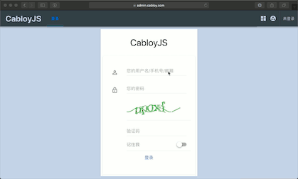
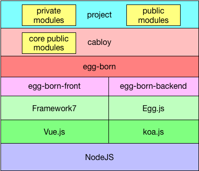

English | [简体中文](./README.zh-CN.md)

# CabloyJS

CabloyJS: The Ultimate NodeJS Full Stack Business Development Framework, based on KoaJS + EggJS + VueJS + Framework7

[![NPM version][npm-image]][npm-url]
[![David deps][david-image]][david-url]
[![NPM download][download-image]][download-url]

[npm-image]: https://img.shields.io/npm/v/cabloy.svg?style=flat-square
[npm-url]: https://npmjs.org/package/cabloy
[david-image]: https://img.shields.io/david/zhennann/cabloy.svg?style=flat-square
[david-url]: https://david-dm.org/zhennann/cabloy
[download-image]: https://img.shields.io/npm/dm/cabloy.svg?style=flat-square
[download-url]: https://npmjs.org/package/cabloy

## Documentations

- [Website && Documentations](https://cabloy.com)

## Demonstration

|Website Type|Website Link|
|--|--|
|Admin System(PC Layout)|[https://admin.cabloy.com](https://admin.cabloy.com)|
|Admin System(Mobile Layout)||
|||
|Blog|[https://zhennann.com](https://zhennann.com)|
|Technical Documentations(English)|[https://cabloy.com/index.html](https://cabloy.com/index.html)|
|Technical Documentations(Chinese)|[https://cabloy.com/zh-cn/index.html](https://cabloy.com/zh-cn/index.html)|
|Community(English)|[https://community.cabloy.com/index.html](https://community.cabloy.com/index.html)|
|Community(Chinese)|[https://community.cabloy.com/zh-cn/index.html](https://community.cabloy.com/zh-cn/index.html)|
|Cabloy Store(English)|[https://store.cabloy.com/index.html](https://store.cabloy.com/index.html)|
|Cabloy Store(Chinese)|[https://store.cabloy.com/zh-cn/index.html](https://store.cabloy.com/zh-cn/index.html)|

## Resources

- [CabloyJS Store](https://store.cabloy.com)
- [CabloyJS Community](https://community.cabloy.com)
- [CabloyJS Awesome](./docs/awesome.md)

## Goals

CabloyJS is a rapid NodeJS full-stack business developement framework for small and medium-sized development teams and freelancers. It supports full scenario business development, saving time and effort

### Difficulties faced by small and medium-sized development teams or freelancers

1. `Multi Scenario`：PC, Android, IOS, Slack, Wechat, DingTalk, etc.
2. `Multi Factor`：Technology, Staffing, Time, Quality -> Cost, Revenue

The potential needs of customers are changing day by day, so the development scenarios are becoming more fragmented. Different scenarios are faced with different technical options, which determine the staffing. The `technical options` and `staffing` affect the `time` and `quality` of project development, and finally balance the `cost` and `revenue`

### How to deal with CabloyJS

1. Through the style of `pc = mobile + pad`, the `UI interaction experience` and `development mode` of the mobile scene are brought into the PC scene
2. CabloyJS is not only a `technical framework`, but also a `business framework`. It precipitates many functional features such as `user management`, `role management` and `permission management`, etc. into core modules, so as to provide strong support for rapid business development
3. The complete `frontend and backend separation` mechanism makes the whole CabloyJS architecture highly flexible and extensible

## Ideas

> Developed quickly and customized flexibly

To achieve this ideas, CabloyJS built-in developed a large number of core modules, so that you can build a complete web project in the shortest possible time. For example, when you build a new web project, you already have a complete user login and authentication system, also has `user management`, `role management`, `permission management`, and other features

In addition, these built-in modules provide flexible customization features. You can also develop new modules to replace the built-in modules to achieve customization of the system

## Bright-point and Pain-point

### 1. Bright-point: pc = mobile + pad

The most prominent bright-point on CabloyJS: Through the style of `pc = mobile + pad`, the `UI interaction experience` and `development mode` of the mobile scene are brought into the PC scene. It not only significantly reduces the amount of code development and improves the efficiency of development, but also maintains the consistency of user manipulation experience

### 2. Pain-point：Multi-scenario Business Development

The most prominent pain-point on CabloyJS: Through modular architecture, multi-scenario business can be rapidly developed

|Scenario|Frontend|Backend|
|--|--|--|
| PC: Web | CabloyJS Frontend |CabloyJS Backend|
| PC: Exe | CabloyJS Frontend + Electron |CabloyJS Backend|
| Mobile: IOS | CabloyJS Frontend + Cordova |CabloyJS Backend|
| Mobile: Android | CabloyJS Frontend + Cordova |CabloyJS Backend|
| Slack | CabloyJS Frontend + Slack API |CabloyJS Backend|
| Wechat| CabloyJS Frontend + Wechat API |CabloyJS Backend|
| Wechat Enterprise| CabloyJS Frontend + Wechat API |CabloyJS Backend|
| DingTalk | CabloyJS Frontend + DingTalk API |CabloyJS Backend|

* Backend: Because of the complete `frontend and backend separation` design, only a set of CabloyJS backend code should be developed
* Frontend: All scenarios that can be based on H5 need only develop a set of CabloyJS frontend code

##  Development Process of CabloyJS

The development of CabloyJS started in 2016. It has gone through two stages:

### 1. Stage One: EggBornJS

EggBornJS mainly provides two core features:

 - **Frontend and Backend Separation**: Separating Frontend and Backend, so as for decoupling
 - **Business Modularization**: The `page components` and `business logics` are arranged as modules

> This is why all business modules are prefixed with `egg-born-module-`

### 2. Stage Two: CabloyJS

EggBornJS is only a basic full-stack development framework. Considering business development, many business-related supporting features need to be provided, such as `User Management`, `Role Management`, `Permission Management`, `Menu Management`, `Settings Management`, `Form Validation`, `Login Mechanism`, and so on

On the basis of EggBornJS, CabloyJS provided a set of core business modules, so as to realize a series of supporting features, which are organically combined to form a complete and flexible upper ecological architecture, thus supporting the specific business development process

## CabloyJS Architecture Diagram

## Features

## EggBornJS Features

- **Frontend and Backend Separation**: Separating Frontend and Backend, so as for decoupling
- **Business Modularization**: The `page components` and `business logics` are arranged as modules
- **Loading Flexibility**: Modules can be loaded `asynchronously` or `synchronously`
- **Highly Modular Cohesion**: The module includes `frontend page components` and `backend business logics`
- **Parameter Configuration Flexibility**: Both frontend and backend of the module can be configured separately
- **i18n**: Both frontend and backend of the module support i18n separately
- **Module Isolation**: Module’s `pages, data, logic, routing, configuration and other elements` have been through `namespace isolation` processing, which avoids the variable pollutions and conflicts
- **Easy Transaction Processing**: Just configuring a parameter on the routing record can process the database transaction perfectly
- **Progressive Development**: Due to the high degree of cohesion of the module, EggBornJS can deposit the business in the form of module, which can be reused in multiple projects. Business modules can be contributed to the npm Open Source Community, and can also be deployed to the company’s internal private npm registry

> With EggBornJS, not only the components can be reused, but also the business modules do from now

## CabloyJS Features

- **Mobile First, Perfect PC Layout Adaptation: pc = mobile + pad**
- **Unified Atom Data Management**
- **Unified User Role Privilege Management**
- **Fine support for multiple runtime environments**
- **Support multi-domain multi-instance operation**
- **Flexible test-driven development**
- **Built-in many core modules, providing a large number of core features**

> With CabloyJS, you can quickly develop all kinds of business applications

## The Faith

> Any application that can be written in Javascript, will eventually be written in Javascript | Jeff Atwood (2007)

It is believed that the deep explorers of Javascript will be inspired by Atwood's law and work together to build a more prosperous application ecosystem for Javascript

CabloyJS is just an exploration of Atwood's law. Instead of repeating wheels, CabloyJS uses the latest open source technology in the industry to optimize full-stack development

More welcome to contribute code and build a prosperous ecosystem of CabloyJS👏

## The Origin of Framework Name

### 1. EggBorn

The origin of this name is relatively simple, because there is Egg (backend framework), so there is EggBorn. There is an animated cartoon called "Tianshu Qitan". Its originator is called "DanSheng". I like to watch it very much (inadvertently exposed the age😅)

### 2. Cabloy

Cabloy comes from the magic spell of the Smurfs. If you spell the word Cabloy correctly, it will have a magical effect. Likewise, CabloyJS is a magic about business development. Based on the combination and biochemical reactions of business modules, you will achieve whatever you want

## License

[LGPL](./LICENSE)
