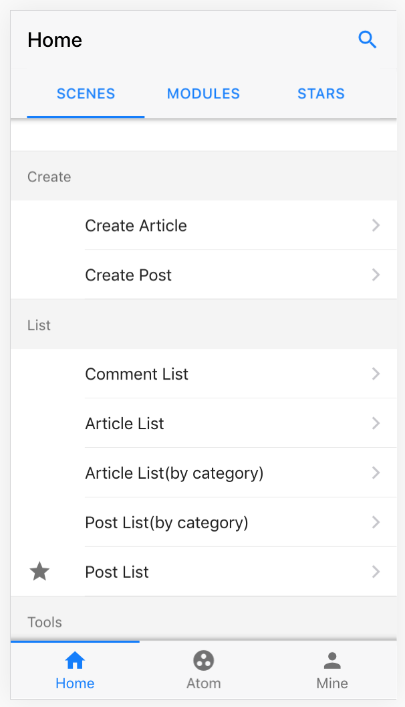
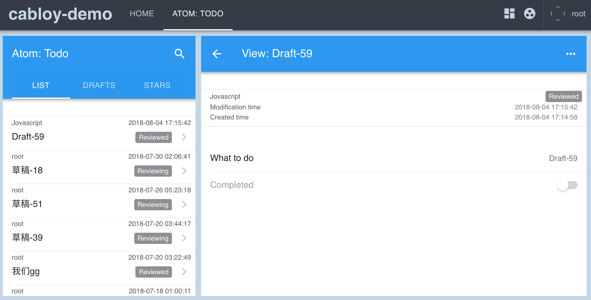

[English](./README.md) | 简体中文

# CabloyJS

CabloyJS是基于EggJS和VueJS开发的一款顶级Javascript全栈业务开发框架

> 前端：VueJS + Framework7

> 后端：KoaJS + EggJS

> 数据库：MySQL

[![NPM version][npm-image]][npm-url]
[![David deps][david-image]][david-url]
[![NPM download][download-image]][download-url]

[npm-image]: https://img.shields.io/npm/v/cabloy.svg?style=flat-square
[npm-url]: https://npmjs.org/package/cabloy
[david-image]: https://img.shields.io/david/zhennann/cabloy.svg?style=flat-square
[david-url]: https://david-dm.org/zhennann/cabloy
[download-image]: https://img.shields.io/npm/dm/cabloy.svg?style=flat-square
[download-url]: https://npmjs.org/package/cabloy

## 文章

- [一文读懂NodeJS全栈开发利器：CabloyJS（万字长文）](https://community.cabloy.com/zh-cn/articles/known-cabloyjs.html)

## 文档

- [官网 && 文档](https://cabloy.com)

## 演示

- PC：[https://admin.cabloy.com](https://admin.cabloy.com)
- Mobile：

## 自适应布局：pc = mobile + pad

Cabloy所有页面开发采用`移动优先`策略，同时完美适配`PC布局`

### Mobile布局

### PC布局

## EggBornJS是什么

EggBornJS是一款顶级Javascript全栈开发框架

前端采用`VueJS + Framework7 + Webpack`，后端采用`KoaJS + EggJS`，数据库采用`mysql`

EggBornJS在纵向上，将前端和后端打通，形成一个有机的整体，避免前端和后端各自为政的状况

EggBornJS在横向上，提炼出“业务模块化”的代码组织模式，通过不同的模块组合实现业务开发，也为大型Web应用不断增长的业务需求提供有力的基础架构

## CabloyJS与EggBornJS的关系

简单的说：

1. `EggBornJS`是一个全栈的`代码加载器`，定义了一套全栈的代码开发规范
2. `CabloyJS`在`EggBornJS`的基础上提供了一套`核心业务模块`，便于快速进行业务开发

`EggBornJS`只是一个基础的全栈开发框架，如果要进行业务开发，还需要考虑许多与业务相关的支撑特性，如：`用户管理、角色管理、权限管理、菜单管理、参数设置管理、表单验证、登录机制`，等等。特别是在前后端分离的场景下，对权限管理的要求就提升到一个更高的水平

`CabloyJS`在`EggBornJS`的基础上，提供了一套`核心业务模块`，从而实现了一系列支持特性，并将这些特性进行有机的组合，形成完整而灵活的上层生态架构，从而支持具体的业务开发进程

> 有了EggBornJS，从此可复用的不仅仅是组件，还有业务模块

> 有了CabloyJS，您就可以快速开发各类业务应用

## EggBornJS与EggJS的关系

`EggBornJS`包含`egg-born-front`和`egg-born-backend`两部分，分别对应`前端`和`后端`的加载机制

从本质上来看，`egg-born-backend`和`EggJS`都是加载器。但是，为了实现`业务模块化`的机制，`egg-born-backend`在`EggJS`的基础上做了许多特性增强，核心特性如下：

1. 在一个`业务模块`中，可以单独设置`后端路由、控制器、服务、中间件、国际化、config配置`等资源
2. 在`EggJS`中，这些资源都是通过`约定代码位置`的方式组织并加载的。而在`egg-born-backend`的`业务模块`中，这些资源都是通过`require`的方式显式组织并加载的。因此，`业务模块`可以进行单独编译
3. `业务模块`可单独编译，从而可以单独发布、单独部署，单独升级，从而促进CabloyJS整个生态圈的繁荣，进一步加速实际业务的开发
4. 另一方面，`业务模块`可单独编译，也可以满足`保护商业代码`的需求

## CabloyJS架构图

## 信念

> 凡是可以用JavaScript来写的应用，最终都会用JavaScript来写 | Atwood定律

相信，Javascript的深度探索者都会被这句名言激发，共同努力，为Javascript生态添砖加瓦，构建更繁荣的应用生态

CabloyJS正是对这一名言的探索之作。CabloyJS不重复造轮子，而是采用业界最新的开源技术，进行全栈开发的最佳组合

欢迎您也加入CabloyJS的社区生态，一起促进Javascript的繁荣与应用

## Cabloy名字的由来

Cabloy来自蓝精灵的魔法咒语，拼对了Cabloy这个单词就会有神奇的效果。同样，CabloyJS是有关化学的魔法，基于原子的组合与生化反应，您将实现您想要的任何东西
