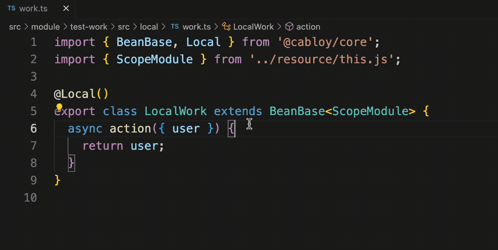
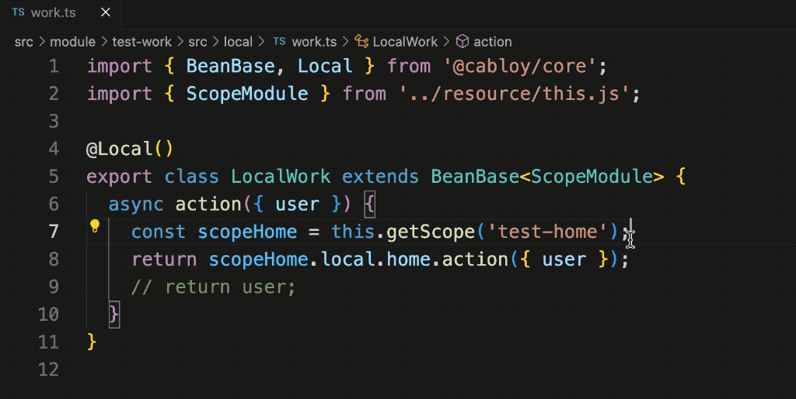
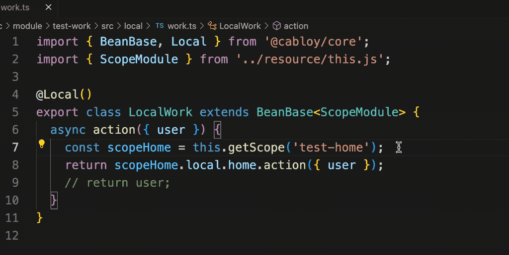
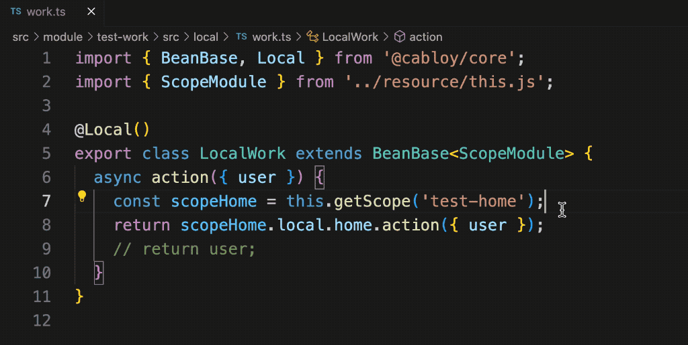

## The best practice of ts: make types invisible

Using ts in a project can bring many benefits of intelligent type prompts and type checks. At the same time, in order to reduce type annotations and achieve the effect of `making types invisible`, CabloyJS introduces the `ioc` and `dependency lookup` mechanisms. In the previous article, we created a business module `test-home`, and used the dependency lookup mechanism to demonstrate how to elegantly define and use resources, including: Service services, Config configurations, international language resources, and Error exceptions

In actual projects, we often encounter cross-module resource access scenarios. So, can CabloyJS's dependency lookup mechanism still achieve cross-module access elegantly? Let's take a look

## Modular system and task description

The front and back ends of the CabloyJS full-stack framework adopt a modular system. A CabloyJS project consists of multiple business modules. Each business module can contain resources related to its own business, such as: Service service, Config configuration, international language resources, Error exception, middleware, scheduled tasks, message queue, System startup items, etc.

Here, we create a new business module `test-work` and access the resources provided by `test-home` in `test-work`

## 1. Create a Business Module

``` bash
cabloy api:create:module test-work
```

## 2. Create a API Endpoint

Create a set of files at the same time through one command

``` bash
cabloy api:create:controller work
```

* Route: `src/module/test-work/src/routes.ts`
* Controller: `src/module/test-work/src/controller/work.ts`
* Service: `src/module/test-work/src/local/work.ts`

## 3. Access Services across modules

Next, we access the Service of the module `test-home` in the newly created Service

``` diff
import { BeanBase, Local } from '@cabloy/core';
import { ScopeModule } from '../resource/this.js';

@Local()
export class LocalWork extends BeanBase<ScopeModule> {
  async action({ user }) {
+   const scopeHome = this.getScope('test-home');
+   return scopeHome.local.home.action({ user });
    // return user;
  }
}
```

1. Obtain the scope object of the module `test-home` through the `getScope` method
2. Directly access the Service `home` through the scope object

Take a look at the animation demo, which provides complete type intelligent prompts:



## 4. Access Config across modules

Access the Config configuration of the module `test-home`

``` diff
import { BeanBase, Local } from '@cabloy/core';
import { ScopeModule } from '../resource/this.js';

@Local()
export class LocalWork extends BeanBase<ScopeModule> {
  async action({ user }) {
    const scopeHome = this.getScope('test-home');
+   const prompt = scopeHome.config.prompt;
    return scopeHome.local.home.action({ user });
    // return user;
  }
}
```

1. Obtain the `prompt` value of config directly through `scopeHome`

Take a look at the animation demo, which provides complete type intelligent prompts:



## 5. Access I18n across modules

Access the I18n resources of the module `test-home`

``` diff
import { BeanBase, Local } from '@cabloy/core';
import { ScopeModule } from '../resource/this.js';

@Local()
export class LocalWork extends BeanBase<ScopeModule> {
  async action({ user }) {
    const scopeHome = this.getScope('test-home');
+   const message = scopeHome.locale.HelloWorld();
+   const message1 = scopeHome.locale.HelloWorld.locale('en-us');
+   const message2 = scopeHome.locale.HelloWorld.locale('zh-cn');
    return scopeHome.local.home.action({ user });
    // return user;
  }
}
```

Take a look at the animation demo, which provides complete type intelligent prompts:



## 6. Access Error Exception across modules

Access and throw the Error exception of the module `test-home`

``` diff
import { BeanBase, Local } from '@cabloy/core';
import { ScopeModule } from '../resource/this.js';

@Local()
export class LocalWork extends BeanBase<ScopeModule> {
  async action({ user }) {
    const scopeHome = this.getScope('test-home');
+   scopeHome.error.Error001.throw();
    return scopeHome.local.home.action({ user });
    // return user;
  }
}
```

1. Throw error exception `Error001` directly through `scopeHome`

Take a look at the animation demo, which provides complete type intelligent prompts:



## Postscript

CabloyJS uses `ioc` and `dependency lookup` mechanisms to reduce type annotations and achieve the effect of `making types invisible`, thus keeping our code elegant and concise, which in turn can significantly improve development efficiency and ensure code quality

For more information, please goto:
 - [YouTube Channel](https://www.youtube.com/@cabloyjs)
 - [Twitter](twitter.com/zhennann2024)
 - zhen.nann@icloud.com

