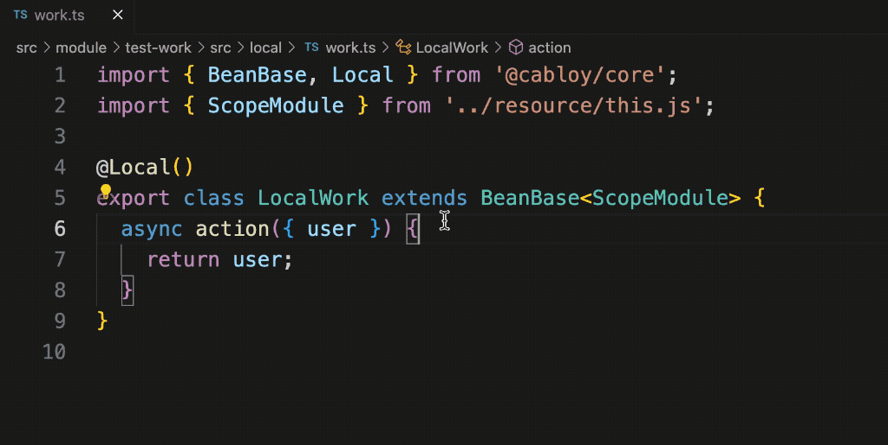
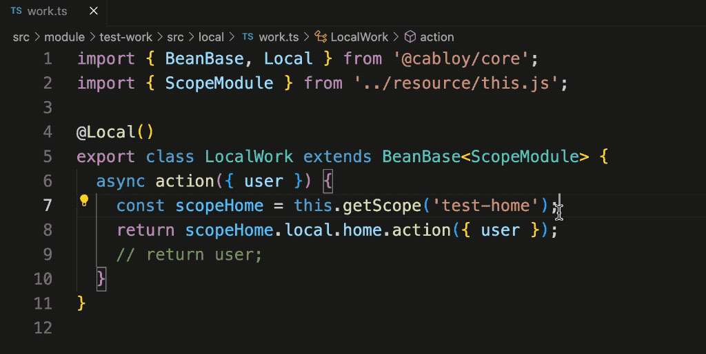
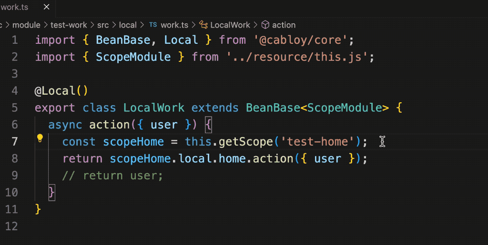
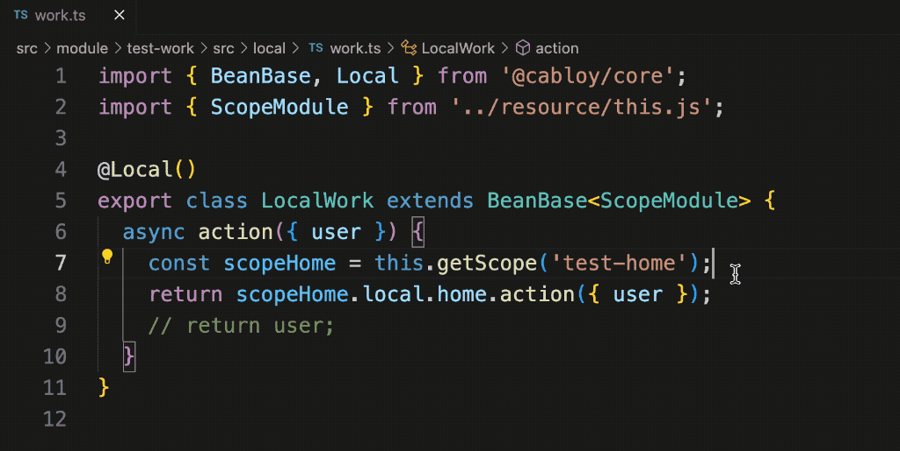

## 使用ts的最佳境界：化类型于无形

在项目中使用ts可以带来类型智能提示与校验的诸多好处。同时，为了减少类型标注，达到`化类型于无形`的效果，CabloyJS引入了ioc和依赖查找的机制。在上一篇文章中，我们创建了一个业务模块test-home，并且采用依赖查找的机制演示了如何优雅的定义和使用资源，包括：Service服务、Config配置、国际化语言资源、Error错误异常

在实际的项目当中，经常会遇到跨模块访问资源的场景，那么，CabloyJS的依赖查找机制是否仍然可以优雅的实现跨模块访问呢？让我们一睹为快

## 模块化体系与任务说明

CabloyJS全栈框架的前后端均采用模块化体系。一个CabloyJS项目由多个业务模块组成，每个业务模块都可以包含与自身业务相关的资源，比如：Service服务、Config配置、国际化语言资源、Error错误异常、中间件、定时任务、消息队列、系统启动项，等等

在这里，我们创建一个新的业务模块test-work，在test-work中访问test-home提供的资源

## 1. 新建业务模块

``` bash
cabloy api:create:module test-work
```

## 2. 新建API

通过一个命令同时创建一组文件：Route、Controller、Service

``` bash
cabloy api:create:controller work
```

## 3. 跨模块访问Service服务

接下来，我们在刚才新建的Service当中，访问模块test-home的Service服务

``` diff
import { BeanBase, Local } from '@cabloy/core';
import { ScopeModule } from '../resource/this.js';

@Local()
export class LocalWork extends BeanBase<ScopeModule> {
  async action({ user }) {
+   const scopeHome = this.getScope('test-home');
+   return scopeHome.local.home.action({ user });
    // return user;
  }
}
```

1. 通过getScope方法获取模块test-home的scope对象
2. 通过scope对象直接访问Service服务: `home`

看一下动画演示，提供了完整的类型智能提示：



## 4. 跨模块访问Config配置

访问模块test-home的Config配置

``` diff
import { BeanBase, Local } from '@cabloy/core';
import { ScopeModule } from '../resource/this.js';

@Local()
export class LocalWork extends BeanBase<ScopeModule> {
  async action({ user }) {
    const scopeHome = this.getScope('test-home');
+   const prompt = scopeHome.config.prompt;
    return scopeHome.local.home.action({ user });
    // return user;
  }
}
```

1. 直接通过scopeHome取得config中的prompt属性值

看一下动画演示，提供了完整的类型智能提示：



## 5. 跨模块访问国际化语言资源

访问模块test-home的国际化语言资源

``` diff
import { BeanBase, Local } from '@cabloy/core';
import { ScopeModule } from '../resource/this.js';

@Local()
export class LocalWork extends BeanBase<ScopeModule> {
  async action({ user }) {
    const scopeHome = this.getScope('test-home');
+   const message = scopeHome.locale.HelloWorld();
+   const message1 = scopeHome.locale.HelloWorld.locale('en-us');
+   const message2 = scopeHome.locale.HelloWorld.locale('zh-cn');
    return scopeHome.local.home.action({ user });
    // return user;
  }
}
```

看一下动画演示，提供了完整的类型智能提示：



## 6. 跨模块访问Error错误异常

抛出模块test-home提供的Error错误异常

``` diff
import { BeanBase, Local } from '@cabloy/core';
import { ScopeModule } from '../resource/this.js';

@Local()
export class LocalWork extends BeanBase<ScopeModule> {
  async action({ user }) {
    const scopeHome = this.getScope('test-home');
+   scopeHome.error.Error001.throw();
    return scopeHome.local.home.action({ user });
    // return user;
  }
}
```

1. 直接通过scopeHome抛出错误异常Error001

看一下动画演示，提供了完整的类型智能提示：



## 后记

CabloyJS采用ioc和依赖查找的机制，让ts的使用达到了`化类型于无形`的最佳境界，从而让我们的代码保持优雅和简洁，进而也能显著提升开发效率，保证代码质量

欲了解更多，请关注每晚8点B站直播：[濮水代码](https://space.bilibili.com/454737998)
