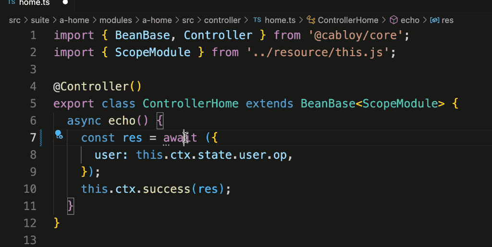

## 一、Cabloy5.0内测预告

Cabloy5.0采用TS对整个全栈框架进行了脱胎换骨般的大重构，并且提供了更加优雅的ts控制反转策略，让我们的业务开发更加快捷顺畅

### 1\. 新旧技术栈对比：

|    | 后端 | 前端 |
|----|----|----|
| 旧版 | js、egg2、mysql | js、vue2、framework7 |
| 新版 | ts、egg3、多数据库兼容（支持mysql、postgresql） | ts、vue3、quasar |

### 2\. 框架开发两大趋势

1. TS化：这是显而易见的趋势，不必赘言

2. ESM化：从目前趋势看，前端框架已经全链路ESM化了，但是，大多数后端框架仍然是Commonjs。即便是egg3也仍然是Commonjs。由于egg的定位仍然是元框架，CabloyJS5.0在egg基础上仍然开发出了全量ESM化的业务模块化系统（在Commonjs之上进行ESM化的具体机制是什么，另有文章阐述）

## 二、比nestjs更优雅的ioc

基于TS的后端框架一般都会提供依赖容器，实现控制反转。控制反转有两种策略：**依赖注入**和**依赖查找**。CabloyJS5.0同时支持**依赖注入**和**依赖查找**，并且通过模块范围的辅助，让**依赖查找**的代码更加简洁高效，下面挑几个特性举例说明:
1. Service服务
2. Config配置
3. 多语言
4. 错误异常

## 三、Service服务

### 1\. 创建一个Service

在CabloyJS中，local bean相当于nestjs中service的概念，下面创建一个local bean

``` javascript
import { BeanBase, Local } from '@cabloy/core';
import { ScopeModule } from '../resource/this.js';

@Local()
export class LocalHome extends BeanBase<ScopeModule> {
  async echo({ user: _user }) {
    return `Hello World!`;
  }
}
```

1. 通过`@Local`声明LocalHome是一个local bean

2. LocalHome继承自基类BeanBase

### 2\. Service的依赖注入

接下来，在Controller中采用依赖注入的方式来使用LocalHome

``` javascript
import { BeanBase, Controller, Use } from '@cabloy/core';
import { ScopeModule } from '../resource/this.js';
import { LocalHome } from '../local/home.js';

@Controller()
export class ControllerHome extends BeanBase<ScopeModule> {
  @Use()
  home: LocalHome;

  async echo() {
    const res = await this.home.echo({
      user: this.ctx.state.user.op,
    });
    this.ctx.success(res);
  }
}
```

1. 使用`@Use`注入LocalHome

### 3\. Service的依赖查找

然后，在Controller中采用依赖查找的方式来使用LocalHome

``` javascript
import { BeanBase, Controller } from '@cabloy/core';
import { ScopeModule } from '../resource/this.js';

@Controller()
export class ControllerHome extends BeanBase<ScopeModule> {
  async echo() {
    const res = await this.scope.local.home.echo({
      user: this.ctx.state.user.op,
    });
    this.ctx.success(res);
  }
}
```

1. 不需要导入LocalHome，直接在代码中使用`this.scope.local`来访问容器中的local bean实例

看一下动画演示，提供了完整的类型智能提示：



## 四、Config配置

### 1. 定义Config

可以为业务模块单独定义一些Config配置，如下：

``` diff
import { CabloyApplication } from '@cabloy/core';

export const config = (_app: CabloyApplication) => {
  return {
+   prompt: 'hello world',
  };
};
```

### 2. 使用Config

可以在LocalHome中直接使用刚才定义的config

``` diff
import { BeanBase, Local } from '@cabloy/core';
import { ScopeModule } from '../resource/this.js';

@Local()
export class LocalHome extends BeanBase<ScopeModule> {
  async echo({ user: _user }) {
+   return this.scope.config.prompt;
-   return `Hello World!`;
  }
}
```

1. 不需要导入任何类型，直接在代码中使用`this.scope.config`来访问当前业务模块中的config配置

看一下动画演示，提供了完整的类型智能提示：


## 五、多语言

### 1. 定义语言资源

可以为业务模块定义语言资源，比如，这里分别定义英文和中文两种语言资源

`英文`
``` javascript
export default {
  HelloWorld: 'Hello World',
};
```

`中文`
``` javascript
export default {
  HelloWorld: '您好世界',
};
```

### 2. 使用语言资源

可以在LocalHome中直接使用刚才定义的语言资源

``` diff
import { BeanBase, Local } from '@cabloy/core';
import { ScopeModule } from '../resource/this.js';

@Local()
export class LocalHome extends BeanBase<ScopeModule> {
  async action({ user: _user }) {
+   // 自动判断当前语言
+   const message = this.scope.locale.HelloWorld();
+   // 强制使用英文资源
+   const message1 = this.scope.locale.HelloWorld.locale('en-us');
+   // 强制使用中文资源
+   const message2 = this.scope.locale.HelloWorld.locale('zh-cn');
+   return `${message}:${message1}:${message2}`;
-   return this.scope.config.prompt;
  }
}
```

1. 不需要导入任何类型，直接在代码中使用`this.scope.locale`来访问当前业务模块中的语言资源

看一下动画演示，提供了完整的类型智能提示：


## 六、错误异常

### 1. 定义错误码

可以为业务模块定义错误码

``` diff
export enum Errors {
+ Error001 = 1001,
}
```
1. 这里定义了一个错误枚举类型Error001，对应的错误码是1001

### 2. 定义错误码对应的语言资源

可以为错误码定义语言资源，比如，这里分别定义英文和中文两种语言资源

`英文`
``` diff
export default {
+ Error001: 'This is a test',
  HelloWorld: 'Hello World',
};
```

`中文`
``` diff
export default {
+ Error001: '这是一个错误',
  HelloWorld: 'Hello World',
};
```


### 3. 抛出错误异常

可以在LocalHome中直接使用刚才定义的错误枚举值，并抛出异常

``` diff
import { ScopeModule } from '../resource/this.js';

@Local()
export class LocalHome extends BeanBase<ScopeModule> {
  async action({ user: _user }) {
+   // 直接抛出异常
+   this.scope.error.Error001.throw();
-   return this.scope.config.prompt;
  }
}
```

1. 不需要导入任何类型，直接在代码中使用`this.scope.error`来访问当前业务模块中的错误枚举值

看一下动画演示，提供了完整的类型智能提示：


## 七、后记

Cabloy4.0中就已经提供了大量业务能力，比如：工作流引擎、表单引擎、权限引擎、字段权限、多级缓存、模块化体系、分布式架构、多租户引擎，等等。随着Cabloy5.0 Typescript的赋能，这些业务能力也随之有了全新的表现

欲了解更多，请关注每晚8点B站直播：[濮水代码](https://space.bilibili.com/454737998)

