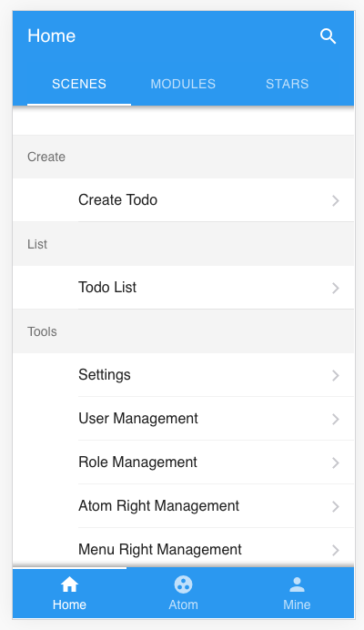
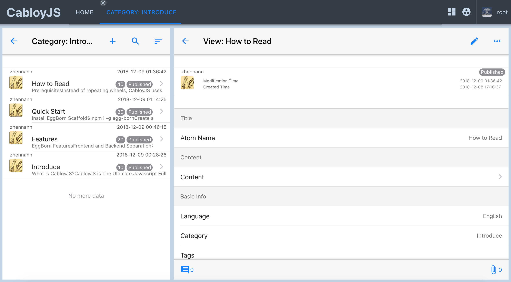

简体中文 | [English](./README.en-US.md)

# CabloyJS

CabloyJS是一款顶级NodeJS全栈业务开发框架, 基于KoaJS + EggJS + VueJS + Framework7

> 前端：VueJS + Framework7

> 后端：KoaJS + EggJS

> 数据库：MySQL

[![NPM version][npm-image]][npm-url]
[![David deps][david-image]][david-url]
[![NPM download][download-image]][download-url]

[npm-image]: https://img.shields.io/npm/v/cabloy.svg?style=flat-square
[npm-url]: https://npmjs.org/package/cabloy
[david-image]: https://img.shields.io/david/zhennann/cabloy.svg?style=flat-square
[david-url]: https://david-dm.org/zhennann/cabloy
[download-image]: https://img.shields.io/npm/dm/cabloy.svg?style=flat-square
[download-url]: https://npmjs.org/package/cabloy

## 文章

- [一文读懂NodeJS全栈开发利器：CabloyJS（万字长文）](https://community.cabloy.com/zh-cn/articles/known-cabloyjs.html)

## 文档

- [官网 && 文档](https://cabloy.com)

## 演示

- PC：[https://admin.cabloy.com](https://admin.cabloy.com)
- Mobile：


## 核心模块

### 内置模块

|名称|说明|
|--|--|
|[egg-born-front](https://github.com/zhennann/egg-born-front)|前端核心|
|[egg-born-backend](https://github.com/zhennann/egg-born-backend)|后端核心|
|[egg-born-bin](https://github.com/zhennann/egg-born-bin)|项目命令行工具|
|[egg-born-scripts](https://github.com/zhennann/egg-born-scripts)|项目命令行启动工具|
|[egg-born-module-a-version](https://github.com/zhennann/egg-born-module-a-version)|数据版本|
|[egg-born-module-a-authgithub](https://github.com/zhennann/egg-born-module-a-authgithub)|Github登录|
|[egg-born-module-a-authsimple](https://github.com/zhennann/egg-born-module-a-authsimple)|用户名/密码登录|
|[egg-born-module-a-base-sync](https://github.com/zhennann/egg-born-module-a-base-sync)|业务核心：用户、角色、权限、原子数据、简单流程等等|
|[egg-born-module-a-baseadmin](https://github.com/zhennann/egg-born-module-a-baseadmin)|业务核心的管理页面|
|[egg-born-module-a-cache](https://github.com/zhennann/egg-born-module-a-cache)|缓存|
|[egg-born-module-a-captcha](https://github.com/zhennann/egg-born-module-a-captcha)|验证码抽象框架|
|[egg-born-module-a-captchasimple](https://github.com/zhennann/egg-born-module-a-captchasimple)|一个验证码实现|
|[egg-born-module-a-components-sync](https://github.com/zhennann/egg-born-module-a-components-sync)|前端UI组件|
|[egg-born-module-a-event](https://github.com/zhennann/egg-born-module-a-event)|后端事件机制|
|[egg-born-module-a-file](https://github.com/zhennann/egg-born-module-a-file)|文件上传|
|[egg-born-module-a-hook](https://github.com/zhennann/egg-born-module-a-hook)|后端Hook机制|
|[egg-born-module-a-index](https://github.com/zhennann/egg-born-module-a-index)|数据库索引|
|[egg-born-module-a-instance](https://github.com/zhennann/egg-born-module-a-instance)|多域名与多实例|
|[egg-born-module-a-layoutmobile](https://github.com/zhennann/egg-born-module-a-layoutmobile)|Mobile布局|
|[egg-born-module-a-layoutpc](https://github.com/zhennann/egg-born-module-a-layoutpc)|PC布局|
|[egg-born-module-a-login](https://github.com/zhennann/egg-born-module-a-login)|用户登录|
|[egg-born-module-a-mail](https://github.com/zhennann/egg-born-module-a-mail)|发送邮件|
|[egg-born-module-a-markdownstyle](https://github.com/zhennann/egg-born-module-a-markdownstyle)|一款基于Github的Markdown样式|
|[egg-born-module-a-mavoneditor](https://github.com/zhennann/egg-born-module-a-mavoneditor)|Markdown编辑器，基于[mavonEditor](https://github.com/hinesboy/mavonEditor)|
|[egg-born-module-a-progress](https://github.com/zhennann/egg-born-module-a-progress)|高级进度条，支持多级进度显示|
|[egg-born-module-a-sequence](https://github.com/zhennann/egg-born-module-a-sequence)|数据序列|
|[egg-born-module-a-settings](https://github.com/zhennann/egg-born-module-a-settings)|设置管理|
|[egg-born-module-a-status](https://github.com/zhennann/egg-born-module-a-status)|状态管理|
|[egg-born-module-a-user](https://github.com/zhennann/egg-born-module-a-user)|与个人用户相关的功能|
|[egg-born-module-a-validation](https://github.com/zhennann/egg-born-module-a-validation)|数据验证|
|[egg-born-module-test-cook](https://github.com/zhennann/egg-born-module-test-cook)|测试模块，仅在开发、测试环境有效|

### 可选模块

|名称|说明|
|--|--|
|[egg-born-module-a-cms](https://github.com/zhennann/egg-born-module-a-cms)|CMS模块，可快速创建博客、技术文档、社区（论坛）、公司官网等静态站点|
|[egg-born-module-cms-sitecommunity](https://github.com/zhennann/egg-born-module-cms-sitecommunity)|论坛模块|
|[egg-born-module-cms-themeaws](https://github.com/zhennann/egg-born-module-cms-themeaws)|主题：AWS风格的博客|
|[egg-born-module-cms-themeblog](https://github.com/zhennann/egg-born-module-cms-themeblog)|主题：博客|
|[egg-born-module-cms-themecommunity](https://github.com/zhennann/egg-born-module-cms-themecommunity)|主题：社区|
|[egg-born-module-cms-themedocs](https://github.com/zhennann/egg-born-module-cms-themedocs)|主题：技术文档|
|[egg-born-module-cms-pluginbase](https://github.com/zhennann/egg-born-module-cms-pluginbase)|插件：基础功能|
|[egg-born-module-cms-pluginarticle](https://github.com/zhennann/egg-born-module-cms-pluginarticle)|插件：文章基础功能|
|[egg-born-module-cms-pluginbacktotop](https://github.com/zhennann/egg-born-module-cms-pluginbacktotop)|插件：回到页首|
|[egg-born-module-cms-pluginblock](https://github.com/zhennann/egg-born-module-cms-pluginblock)|插件：Markdown自定义区块框架|
|[egg-born-module-cms-pluginfixcontainersite](https://github.com/zhennann/egg-born-module-cms-pluginfixcontainersite)|插件：调整首页容器的高度|
|[egg-born-module-cms-pluginmarkdowngithub](https://github.com/zhennann/egg-born-module-cms-pluginmarkdowngithub)|插件：一款基于Github的Markdown样式|
|[egg-born-module-cms-pluginrss](https://github.com/zhennann/egg-born-module-cms-pluginrss)|插件：RSS|
|[egg-born-module-cms-pluginsidebar](https://github.com/zhennann/egg-born-module-cms-pluginsidebar)|插件：侧边栏组件|
|[egg-born-module-cms-pluginsocialshare](https://github.com/zhennann/egg-born-module-cms-pluginsocialshare)|插件：社会化分享（一组按钮）|
|[egg-born-module-cms-plugintrack](https://github.com/zhennann/egg-born-module-cms-plugintrack)|插件：Google统计、百度统计、腾讯统计|

## 亮点与痛点

### 1. 亮点：pc = mobile + pad

CabloyJS最大的亮点是：通过`pc=mobile+pad`的模式，把mobile场景的`操控体验`和`开发模式`带⼊pc场景。既显著减少了代码开发量，提升了开发效率，⼜保持了用户操控体验的⼀致性


#### Mobile布局



#### PC布局



### 2. 痛点：全场景业务开发

CabloyJS最大的痛点是：通过模块化的架构设计，可以快速开发全场景业务

|场景|前端|后端|
|--|--|--|
| PC：Web | CabloyJS前端 |CabloyJS后端|
| PC：Exe | CabloyJS前端 + Electron |CabloyJS后端|
| Mobile：IOS | CabloyJS前端 + Cordova |CabloyJS后端|
| Mobile：Android | CabloyJS前端 + Cordova |CabloyJS后端|
|微信公共号| CabloyJS前端 + 微信API |CabloyJS后端|
|企业微信| CabloyJS前端 + 微信API |CabloyJS后端|
| 钉钉 | CabloyJS前端 + 钉钉API |CabloyJS后端|
| Slack | CabloyJS前端 + Slack API |CabloyJS后端|
| 小程序：微信、支付宝、百度等 |小程序框架|CabloyJS后端|

* 后端：由于完整的前后端分离设计，只需开发一套CabloyJS后端代码即可
* 前端：所有可基于H5的场景，只需开发一套CabloyJS前端代码即可

## 特点与理念

### 1. 特点

* CabloyJS是采用NodeJS进行全栈开发的最佳实践
* CabloyJS不重复造轮子，而是采用业界最新的开源技术，进行全栈开发的最佳组合
* CabloyJS前端采用VueJS + Framework7 + WebPack，后端采用KoaJS + EggJS，数据库采用MySQL
* CabloyJS时刻跟踪开源技术的最新成果，并持续优化，使整个框架时刻保持最佳状态

### 2. 理念

> 既可快速开发，又可灵活定制

为了实现此理念，CabloyJS内置开发了大量核心模块，使您可以在最短的时间内架构一个完整的Web项目。比如，当您新建一个Web项目时，就已经具备完整的用户登录与认证系统，也具有验证码功能，同时也具备`用户管理`、`角色管理`、`权限管理`等功能

此外，这些内置模块提供了灵活的定制特性，您也可以开发全新的模块来替换内置模块，从而实现系统的定制化

## CabloyJS核心解决什么问题

1. 场景碎片化
2. 业务模块化

### 1. 场景碎片化

#### 1) 先说说`Mobile场景`

我们知道，随着智能机的日益普及，咱们开发人员所面对的需求场景与开发场景日益碎片化，如浏览器、IOS、Android，还有大量第三方平台：微信、企业微信、钉钉、Facebook、Slack等等

随着智能设备性能越来越好，网速越来越快，针对如此众多的开发场景，采用H5开发必将是大势所趋。只需开发一套代码，就可以在以上所有智能设备中运行，不仅可以显著减少开发量，同时也可以显著提升开发效率，对开发团队和终端用户均是莫大的福利

#### 2) 再来谈谈`PC场景`

以上咱们说H5开发，只需开发一套代码，就可以在所有智能设备中运行。但是还有一个开发场景没有得到统一：那就是`PC场景`

由于屏幕显示尺寸的不同，`PC场景`和`Mobile场景`有着不同的操作风格。有些前端UI框架，采用“自适应”策略，为PC场景开发的页面，在Mobile场景下虽然也能查看和使用，但使用体验往往差强人意

> 这也就是为什么有些前端框架总是成对出现的原因：如Element-UI和Mint-UI，如AntDesign和AntDesign-Mobile

这也就意味着，当我们同时面对`PC场景`和`Mobile场景`时，仍然需要开发两套代码。在面对许多开发需求时，这些重复的工作量往往是难以接受的：
1. 比如，我们在企业微信或钉钉上开发一些H5业务应用，同时也希望这些应用也可以在PC端浏览器中运行
2. 比如，我们为微信公共号开发了一些H5业务应用，同时也希望这些应用也可以在PC端浏览器中运行。同时，还可以在同一架构下开发后台管理类功能，通过区别不同的登录用户、不同的使用场景，从而显示不同的前端页面

#### 3) PC = MOBILE + PAD

CabloyJS前端采用Framework7框架，目前已同步升级到最新版Framework7 V4。CabloyJS在Framework7的基础上进行了巧妙的扩展，将PC端的页面切分为多个区域，实现了多个Mobile和PAD同时呈现在一个PC端的效果。换句话说，你买了一台Mac，就相对于买了多台IPhone和IPad，用多个虚拟的移动设备同时工作，即显著提升了工作效率，也提供了非常有趣的使用体验

#### 4) 实际效果

> 有图有真相


### 2. 业务模块化

NodeJS的蓬勃发展，为前后端开发带来了更顺畅的体验，显著提升了开发效率。但仍有网友质疑NodeJS能否胜任大型Web应用的开发。大型Web应用的特点是随着业务的增长，需要开发大量的页面组件。面对这种场景，一般有两种解决方案：

1. 采用单页面的构建方式，缺点是产生的部署包很大
2. 采用页面异步加载方式，缺点是页面过于零散，需要频繁从后端获取JS资源

CabloyJS实现了第三种解决方案：

3. 页面组件按业务需求归类，进行模块化，并且实现了模块的异步加载机制，从而弥合了前两种解决方案的缺点，完美满足大型Web应用业务持续增长的需求

在CabloyJS中，一切业务开发皆以业务模块为单位。比如，我们要开发一个CMS建站工具，就新建一个业务模块，如已经实现的模块`egg-born-module-a-cms`。该CMS模块包含十多个Vue页面组件，在正式发布时，就会构建成一个JS包。在运行时，只需异步加载这一个JS包，就可以访问CMS模块中任何一个Vue页面组件了

因此，在一个大型的Web系统中，哪怕有数十甚至上百个业务模块，按CabloyJS的模块化策略进行代码组织和开发，既不会出现单一巨大的部署包，也不会出现大量碎片化的JS构建文件

CabloyJS的模块化系统还有如下显著的特点：

#### 1) 零配置、零代码

也就是说，前面说到的模块化异步打包策略是已经精心调校好的系统核心特性，我们只需像平时一样开发Vue页面组件，在构建时系统会自动进行模块级别的打包，同时在运行时进行异步加载

#### 2) 模块自洽、即插即用

每个业务模块都是自洽的整体，包含与本模块业务相关的前端代码和后端代码，而且采用前后端分离模式

`模块自洽`既有利于自身的`高度内聚`，也有利于整个系统的`充分解耦`。业务模块只需要考虑自身的逻辑实现，容易实现业务的`充分沉淀与分享`，达到`即插即用`的效果

举一个例子：如果我们要开发文件上传功能，当我们在网上找到合适的上传组件之后，在自己的项目中使用时，仍然需要开发大量对接代码。也就是说，在网上找到的上传组件没有实现充分的沉淀，不是自洽的，也就不能实现便利的分享，达到`即插即用`的效果

而CabloyJS内置的的文件上传模块`egg-born-module-a-file`就实现了功能的充分沉淀。为什么呢？因为业务模块本身就包含前端代码和后端代码，能够施展的空间很大，可以充分细化上传逻辑

因此，在CabloyJS中要调用文件上传功能，就会变得极其便捷。以CMS模块为例，上传图片并取得图片URL，只需短短20行代码

`egg-born-module-a-cms/src/module/a-cms/front/src/pages/article/contentEdit.vue`

``` javascript
...
    onUpload(mode, atomId) {
      return new Promise((resolve, reject) => {
        this.$view.navigate('/a/file/file/upload', {
          context: {
            params: {
              mode,
              atomId,
            },
            callback: (code, data) => {
              if (code === 200) {
                resolve({ text: data.realName, addr: data.downloadUrl });
              }
              if (code === false) {
                reject();
              }
            },
          },
        });
      });

```

#### 3) 模块隔离

在大型Web项目中，不可避免的要考虑各类资源、各种变量、各个实体之间命名的冲突问题。针对这个问题，不同的开发团队大都会规范各类实体的命名规范。随着项目的扩充，这种命名规范仍然会变得很庞杂。如果我们面对的是一个开放的系统，使用的是来自不同团队开发的模块，所面临的命名冲突的风险就会越发严重

CabloyJS使用了一个巧妙的设计，一劳永逸解决了命名冲突的隐患。在CabloyJS中，业务模块采用如下命名规范：

```
egg-born-module-{providerId}-{moduleName}
```

* `providerId`: 开发者Id，强烈建议采用Github的Username，从而确保贡献到社区的模块不会冲突
* `moduleName`: 模块名称

由于`模块自洽`的设计机制，我们只需要解决模块命名的唯一性问题，在进行模块开发时就不会再被命名冲突的困扰所纠缠了

比如，CMS模块提供了一个前端页面路由`config/list`。很显然，如此简短的路径，在其他业务模块中出现的概率非常高。但在CabloyJS中，如此命名就不会产出冲突。在CMS模块内部进行页面跳转时，可以直接使用`config/list`，这称之为`相对路径`引用。但是，如果其他业务模块也想跳转至此页面就使用`/a/cms/config/list`，这称之为`绝对路径`引用

再比如，前面的例子我们要调用上传文件页面，就是采用`绝对路径`：`/a/file/file/upload`

`模块隔离`是业务模块的核心特性。这是因为，模块前端和后端有大量实体都需要进行这种隔离。CabloyJS从系统层面完成了这种隔离的机制，从而使得我们在实际的模块业务开发时可以变得轻松、便捷

> 模块前端隔离机制

模块前端的隔离机制由模块`egg-born-front`来完成，实现了如下实体的隔离：

1. 前端页面组件路由：[参见](https://cabloy.com/zh-cn/articles/7503a4d34b83409ba6477135fa840736.html)
2. 前端参数配置：[参见](https://cabloy.com/zh-cn/articles/3952948bf69e4fc2ae6930d1fc58ba0f.html)
3. 前端状态管理：[参见](https://cabloy.com/zh-cn/articles/096584b6a8174fea9039d745a812bea7.html)
4. 前端国际化：[参见](https://cabloy.com/zh-cn/articles/1c7c9cf3861744c2a63ae134076c652f.html)

> 模块后端隔离机制
 
模块后端的隔离机制由模块`egg-born-backend`来完成，实现了如下实体的隔离：

1. 后端API接口路由：[参见](https://cabloy.com/zh-cn/articles/515720864cc14d6b94c3194283272bb6.html)
2. 后端Service：[参见](https://cabloy.com/zh-cn/articles/fbe1d2789f1343fdb210e3acaac2097f.html)
3. 后端Model：[参见](https://cabloy.com/zh-cn/articles/d33153578d564a79a7ed1176944d0541.html)
4. 后端参数配置：[参见](https://cabloy.com/zh-cn/articles/13e14810cb124ac2908220caf4f29ac4.html)
5. 后端Error处理：[参见](https://cabloy.com/zh-cn/articles/b81df4d4ed4d4428b286d41a8d7bbca3.html)
6. 后端国际化：[参见](https://cabloy.com/zh-cn/articles/f6d5a48f10dc40d3b8aed7862c23570b.html)

#### 4) 快速的前端构建

CabloyJS采用WebPack进行项目的前端构建。由于CabloyJS项目是由一系列业务模块组成的，因此，可以把模块代码提前预编译，从而在构建整个项目的前端时就可以显著提升构建速度

经实践，如果一个项目包含40个业务模块，如果按照普通的构建模式需要70秒构建完成。而采用预编译的机制，则只需要20秒即可完成。这对于开发大型Web项目具有显著的工程意义

#### 5) 保护商业代码

CabloyJS中的业务模块，不仅前端代码可以构建，后端代码也可以用WebPack进行构建。后端代码在构建时，也可以指定是否丑化，这种机制可以满足`保护商业代码`的需求

> CabloyJS后端的基础是EggJS，是如何做到可以编译构建的呢？

CabloyJS后端在EggJS的基础上进行了扩展，每个业务模块都有一个入口文件main.js，通过main.js串联后端所有JS代码，因此可以轻松实现编译构建

## CabloyJS的开发历程

CabloyJS从2016年启动开发，主要历经两个开发阶段：

### 1. 第一阶段：EggBornJS

EggBornJS关注的核心就是实现一套完整的以业务模块为核心的全栈开发框架

比如模块`egg-born-front`是框架前端的核心模块，模块`egg-born-backend`是框架后端的核心模块，模块`egg-born`是框架的命令行工具，用于创建项目骨架

这也是为什么所有业务模块都是以`egg-born-module-`为命名前缀的原因

### 2. 第二阶段：CabloyJS

EggBornJS只是一个基础的全栈开发框架，如果要进行业务开发，还需要考虑许多与业务相关的支撑特性，如：`用户管理`、`角色管理`、`权限管理`、`菜单管理`、`参数设置管理`、`表单验证`、`登录机制`，等等。特别是在前后端分离的场景下，对`权限管理`的要求就提升到一个更高的水平

CabloyJS在EggBornJS的基础上，提供了一套核心业务模块，从而实现了一系列业务支撑特性，并将这些特性进行有机的组合，形成完整而灵活的上层生态架构，从而支持具体的业务开发进程

> 有了EggBornJS，从此可复用的不仅仅是组件，还有业务模块

> 有了CabloyJS，您就可以快速开发各类业务应用

## CabloyJS架构图


## 信念

> 凡是可以用JavaScript来写的应用，最终都会用JavaScript来写 | Atwood定律

相信，Javascript的深度探索者都会被这句名言激发，共同努力，为Javascript生态添砖加瓦，构建更繁荣的应用生态

CabloyJS正是对这一名言的探索之作。CabloyJS不重复造轮子，而是采用业界最新的开源技术，进行全栈开发的最佳组合

欢迎您也加入CabloyJS的社区生态，一起促进Javascript的繁荣与应用

## 名称的由来

### 1. EggBorn

这个名称的由来比较简单，因为有了Egg(后端框架)，所以就有了EggBorn。有一部动画片叫《天书奇谭》，里面的萌主就叫“蛋生”，我很喜欢看（不小心暴露了年龄😅）

### 2. Cabloy

Cabloy来自蓝精灵的魔法咒语，拼对了Cabloy这个单词就会有神奇的效果。同样，CabloyJS是有关化学的魔法，基于模块的组合与生化反应，您将实现您想要的任何东西

## License

[LGPL](./LICENSE)

