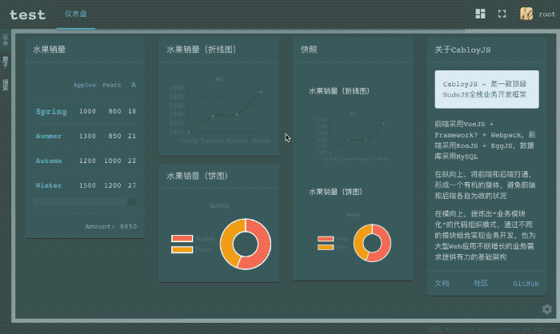
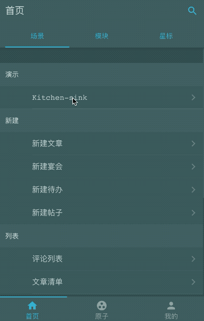
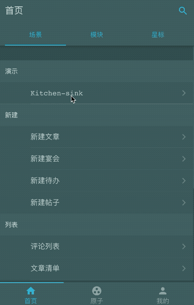
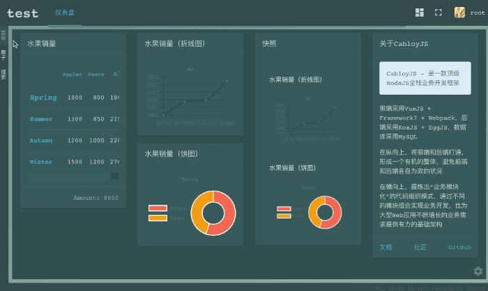
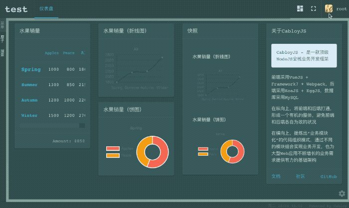

简体中文 | [English](./README.md)

# CabloyJS

CabloyJS是一款顶级NodeJS全栈业务开发框架, 基于KoaJS + EggJS + VueJS + Framework7

[![NPM version][npm-image]][npm-url]
[![David deps][david-image]][david-url]
[![NPM download][download-image]][download-url]

[npm-image]: https://img.shields.io/npm/v/cabloy.svg?style=flat-square
[npm-url]: https://npmjs.org/package/cabloy
[david-image]: https://img.shields.io/david/zhennann/cabloy.svg?style=flat-square
[david-url]: https://david-dm.org/zhennann/cabloy
[download-image]: https://img.shields.io/npm/dm/cabloy.svg?style=flat-square
[download-url]: https://npmjs.org/package/cabloy

## 文档

- [官网 && 文档](https://cabloy.com)

## 在线演示

|网站类型|网站链接|
|--|--|
|管理系统（PC布局）|[https://admin.cabloy.com](https://admin.cabloy.com)|
|管理系统（Mobile布局）||
|||
|博客|[https://zhennann.com](https://zhennann.com)|
|技术文档（英文）|[https://cabloy.com/index.html](https://cabloy.com/index.html)|
|技术文档（中文）|[https://cabloy.com/zh-cn/index.html](https://cabloy.com/zh-cn/index.html)|
|社区（英文）|[https://community.cabloy.com/index.html](https://community.cabloy.com/index.html)|
|社区（中文）|[https://community.cabloy.com/zh-cn/index.html](https://community.cabloy.com/zh-cn/index.html)|
|Cabloy商店（英文）|[https://store.cabloy.com/index.html](https://store.cabloy.com/index.html)|
|Cabloy商店（中文）|[https://store.cabloy.com/zh-cn/index.html](https://store.cabloy.com/zh-cn/index.html)|

## 资源

### 英文版

- [CabloyJS Store](https://store.cabloy.com/index.html)
- [CabloyJS Community](https://community.cabloy.com/index.html)
- [CabloyJS Awesome](./docs/awesome.md)

### 中文版

- [CabloyJS 商店](https://store.cabloy.com/zh-cn/index.html)
- [CabloyJS 社区](https://community.cabloy.com/zh-cn/index.html)
- [CabloyJS Awesome](./docs/awesome.zh-CN.md)

### QQ官方交流群

  

### 文章

- [一文读懂NodeJS全栈开发利器：CabloyJS（万字长文）](https://community.cabloy.com/zh-cn/articles/known-cabloyjs.html)

### 视频

- [网易免费课程 - CabloyJS全栈业务开发实战](https://study.163.com/course/courseMain.htm?courseId=1209403891)

## 截图

### 1. 自适应布局

#### 1.1 PC布局

#### 1.2 Mobile布局

### 2. 国际化

### 3. 主题

### 4. 拖拽

#### 4.1 移动

#### 4.2 调整尺寸

### 5. 仪表盘

#### 5.1 如何使用仪表盘

#### 5.2 如何创建一个新的仪表盘

### 6. PC布局

#### 6.1 头部按钮

#### 6.2 左边栏

#### 6.3 右边栏

#### 6.4 状态栏（左）

#### 6.5 状态栏（右）

### 7. Socket IO

#### 7.1 IM

用户向系统发送一条消息，系统通过`websocket在线通道`向用户推送一条回复

#### 7.2 进度条

系统通过`websocket在线通道`向前端实时推送任务的进度

## 定位

CabloyJS是面向`中小开发团队`和`接单侠`开发的NodeJS全栈业务快速开发框架，支持全场景业务开发，省时、省力

### 中小开发团队或接单侠所面临的困境

1. `多场景需求`：PC、Android、IOS、微信、钉钉，等等
2. `多种要素平衡`：技术、人才、时间、质量 -> 成本、收益

客户的潜在需求日益多变，因此开发场景日益碎片化，不同的场景又面临着不同的技术选择，从而又决定着人员的配备，`技术选择`与`人员配置`影响着项目开发的`时间`与`质量`，从而又最终体现在`成本`与`收益`的平衡上

### CabloyJS应对之法

1. 采用`pc = mobile + pad`的独特页面风格，把移动端的开发体验与用户操控体验带入pc端，一套代码适应全场景需求
2. CabloyJS不仅是`技术框架`，更是`业务框架`，将`用户管理`、`角色管理`、`权限管理`等诸多功能特性沉淀成核心模块，从而为快速业务开发提供强有力的支撑
3. 彻底的`前后端分离`体系，从而实现`前端灵活多变，后端不变应万变`，使整个CabloyJS架构具有很强的灵活性和延展性

## 理念

> 既可快速开发，又可灵活定制

为了实现此理念，CabloyJS内置开发了大量核心模块，使您可以在最短的时间内架构一个完整的Web项目。比如，当您新建一个Web项目时，就已经具备完整的用户登录与认证系统，也具有验证码功能，同时也具备`用户管理`、`角色管理`、`权限管理`等功能

此外，这些内置模块提供了灵活的定制特性，您也可以开发全新的模块来替换内置模块，从而实现系统的定制化

## 风格

CabloyJS决不重复制造轮子，而是在业界流行技术框架基础之上做的`继承再创新`，比如前端基于`VueJS + Framework7`，后端基于`KoaJS + EggJS`

有了这些底层框架的强大支撑，CabloyJS就可以放开手脚在业务层面做大量的创新与沉淀，从而将`NodeJS全栈开发`的体验带入一个新的层面

因此，CabloyJS的风格就是`别具一格`，一旦用上就会`爱不释手`，因为`顺畅而愉悦`的全栈开发体验本来就应该是这样

## 亮点与痛点

### 1. 亮点：pc = mobile + pad

CabloyJS最大的亮点是：通过`pc=mobile+pad`的模式，把mobile场景的`操控体验`和`开发模式`带⼊pc场景。既显著减少了代码开发量，提升了开发效率，⼜保持了用户操控体验的⼀致性

### 2. 痛点：全场景业务开发

CabloyJS最大的痛点是：通过模块化的架构设计，可以快速开发全场景业务

|场景|前端|后端|
|--|--|--|
| PC：Web | CabloyJS前端 |CabloyJS后端|
| PC：Exe | CabloyJS前端 + Electron |CabloyJS后端|
| Mobile：IOS | CabloyJS前端 + Cordova |CabloyJS后端|
| Mobile：Android | CabloyJS前端 + Cordova |CabloyJS后端|
|微信公共号| CabloyJS前端 + 微信API |CabloyJS后端|
|企业微信| CabloyJS前端 + 微信API |CabloyJS后端|
| 钉钉 | CabloyJS前端 + 钉钉API |CabloyJS后端|
| Slack | CabloyJS前端 + Slack API |CabloyJS后端|
| 小程序：微信、支付宝、百度等 |小程序框架|CabloyJS后端|

* 后端：由于完整的前后端分离设计，只需开发一套CabloyJS后端代码即可
* 前端：所有可基于H5的场景，只需开发一套CabloyJS前端代码即可

## CabloyJS的开发历程

CabloyJS从2016年启动开发，主要历经两个开发阶段：

### 1. 第一阶段：EggBornJS

EggBornJS关注的核心就是`模块化`与`模块隔离`，并以此实现一套完整的全栈开发框架

比如模块`egg-born-front`是框架前端的核心模块，模块`egg-born-backend`是框架后端的核心模块，模块`egg-born`是框架的命令行工具，用于创建项目骨架

这也是为什么所有业务模块都是以`egg-born-module-`为命名前缀的原因

### 2. 第二阶段：CabloyJS

EggBornJS只是一个基础的全栈开发框架，如果要进行业务开发，还需要考虑许多与业务相关的支撑特性，如：`用户管理`、`角色管理`、`权限管理`、`菜单管理`、`参数设置管理`、`表单验证`、`登录机制`，等等。特别是在前后端分离的场景下，对`权限管理`的要求就提升到一个更高的水平

CabloyJS在EggBornJS的基础上，提供了一套核心业务模块，从而实现了一系列业务支撑特性，并将这些特性进行有机的组合，形成完整而灵活的上层生态架构，从而支持具体的业务开发进程

## CabloyJS架构图

## 特性

## EggBornJS特性

- **前后端分离**：前后端分离开发，深度解耦
- **业务模块化**：`页面组件`和`业务逻辑`按模块组织
- **加载方式灵活**：模块既可`异步加载`，也可`同步加载`
- **模块高度内聚**：模块包括`前端页面组件`和`后端业务逻辑`
- **参数配置灵活**：模块中的前后端可以单独进行`参数配置`
- **国际化**：模块中的前后端均支持独立的`国际化`
- **模块隔离**：模块的`页面、数据、逻辑、路由、配置`等元素均进行了`命名空间隔离`处理，避免模块之间的变量污染与冲突
- **超级易用的事务处理**：只需在路由记录上配置一个参数，即可完美实现数据库的`事务处理`
- **渐进式开发**：由于模块的高度内聚，可以将业务以模块的形式沉淀，在多个项目中重复使用，既可贡献到npm开源社区，也可部署到公司内部私有npm仓库

> 有了EggBornJS，从此可复用的不仅仅是组件，还有业务模块

## CabloyJS特性

- **移动优先，完美的PC布局适配：pc = mobile + pad**
- **统一的原子数据管理**
- **统一的用户角色权限管理**
- **对多种运行环境的精细支持**
- **支持多域名多实例运行**
- **灵活的测试驱动开发**
- **内置众多核心模块，提供大量核心特性**

> 有了CabloyJS，您就可以快速开发各类业务应用

## 信念

> 凡是可以用JavaScript来写的应用，最终都会用JavaScript来写 | Atwood定律

相信，Javascript的深度探索者都会被这句名言激发，共同努力，为Javascript生态添砖加瓦，构建更繁荣的应用生态

CabloyJS正是对这一名言的探索之作。CabloyJS不重复造轮子，而是采用业界最新的开源技术，进行全栈开发的最佳组合

欢迎您也加入CabloyJS的社区生态，一起促进Javascript的繁荣与应用

## 名称的由来

### 1. EggBorn

这个名称的由来比较简单，因为有了Egg(后端框架)，所以就有了EggBorn。有一部动画片叫《天书奇谭》，里面的萌主就叫“蛋生”，我很喜欢看（不小心暴露了年龄😅）

### 2. Cabloy

Cabloy来自蓝精灵的魔法咒语，拼对了Cabloy这个单词就会有神奇的效果。同样，CabloyJS是有关化学的魔法，基于模块的组合与生化反应，您将实现您想要的任何东西

## License

[LGPL](./LICENSE)
