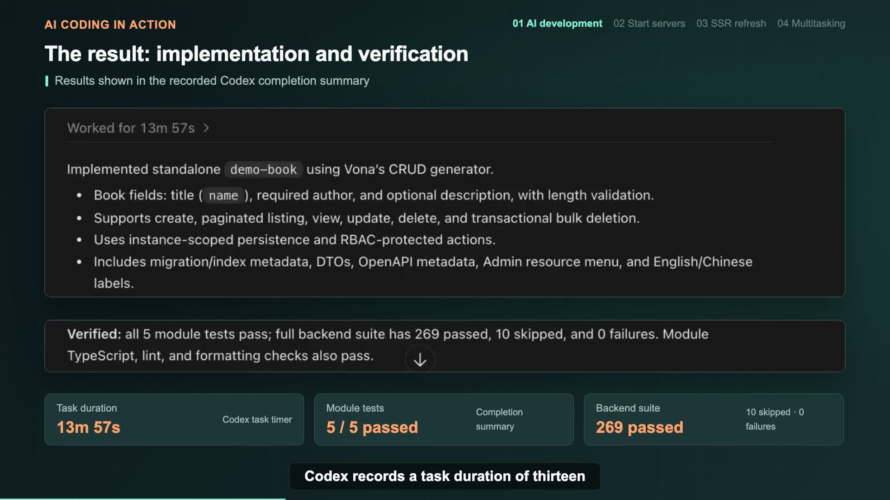
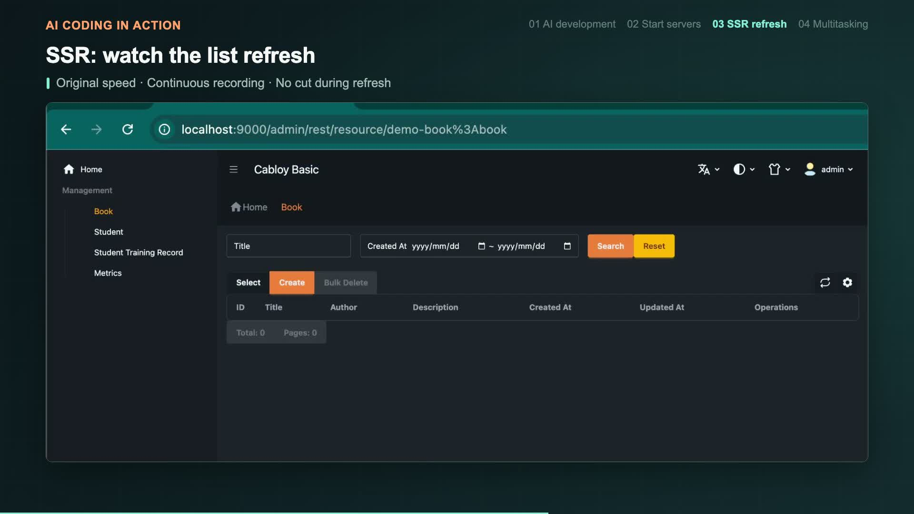
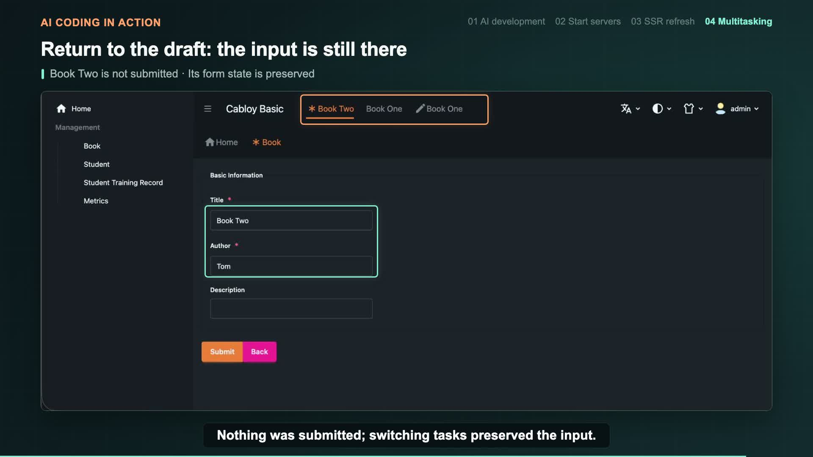

# AI Coding in Action: One Prompt for CRUD, SSR & Multitasking

If you ask AI to build a book management feature, what do you expect to get back?

A set of APIs and a few source files—or an Admin page you can open in a browser and actually use?

Let's try it in **CabloyJS**. We'll give Codex one prompt to develop and test a Book CRUD module. Then we'll start the servers, open the Admin interface, create a book, and keep edit, detail, and create tasks open at the same time.

You'll see more than how AI writes code. You'll get a feel for the finished feature: **what happens when you refresh the list, how you switch between tasks, and whether an unsubmitted form keeps its input.**

## 1. Start with One Prompt

Open Codex in an existing, configured CabloyJS project and enter:

```text
Create a standalone demo-book module to implement CRUD operations for books.
```

This gives Codex two clear goals:

- Create a standalone `demo-book` module.
- Implement CRUD—create, read, update, and delete—for books.

We're using a Cabloy Basic project, with **Vona** on the backend and **Zova** on the frontend. The project already has a module structure, development commands, and an Admin interface. Our job is to add a business feature on top of that foundation.

The prompt doesn't need to specify every controller, data model, form component, or page layout. Codex first reads the project conventions, examines the existing structure and tools, and follows the project's development workflow.

### What Does AI Actually Do?

For this feature, Codex's work follows four steps:

```text
Understand the project → Run the CRUD generator → Refine fields and integration → Run tests and checks
```

It examines the project and generator commands, then uses Vona's CRUD generator to create the module. Next, it refines the book fields, validation, menu integration, and supporting code so the resource becomes available in the existing Admin interface.

The resulting book form has three fields:

| Field | Purpose | Requirement |
| --- | --- | --- |
| Title | Book title | Required |
| Author | Book author | Required |
| Description | Book description | Optional |

One useful part of the development experience is immediately apparent: **once the business resource is defined, the list, detail view, and forms can reuse CabloyJS's existing schema-driven CRUD pages. There is no need to build a new management interface from scratch.**

AI adds the business module; the framework supplies the reusable capabilities. Together, they let you focus on the fields and operations a book needs rather than rebuilding page structures and basic interactions for every resource.

## 2. Development Includes Tests

After creating the module, Codex continues with tests, TypeScript checks, linting, and formatting checks.

This development task took **13 minutes and 57 seconds**. Codex's completion summary reports:

- All five Book module tests passed.
- The backend test suite had 269 passed, ten skipped, and zero failed.
- TypeScript, lint, and formatting checks passed.



The implemented capabilities include create, paginated listing, detail viewing, update, delete, and transactional bulk deletion.

At this point, a single business request has led to a module implementation and automated checks. Now let's start the servers and see what the feature feels like in the interface.

## 3. Two Commands to Open Book Management

In the project root, open the first terminal and start the backend development server:

```bash
npm run dev
```

Open a second terminal and start the Admin frontend development server:

```bash
npm run dev:zova:admin
```

Once the servers are ready, open the Admin interface and select **Book** from the menu on the left.

The book list is already part of the existing Admin layout: the management menu on the left, search filters and records in the main area, and page navigation above. Creating, searching, and working with records all happen in the same interface.

That's the first tangible result of adding the module: **you haven't just gained source files. You have a new business feature you can open and use.**

### Refresh the List and Experience SSR

The book list supports SSR, or server-side rendering.

Refresh the browser while on the list page. The layout shows no obvious flicker during the refresh and retains the familiar Admin structure.



For someone using the application, the first impression is not the implementation details of SSR—it's how the page appears when opened or refreshed. For the developer, the Book module is now part of CabloyJS's SSR-enabled Admin interface, without having to build an SSR mechanism specifically for this CRUD feature.

## 4. Create a Book: From Form to List

Click **Create** to open the book form and enter:

```text
Title: Book One
Author: Kevin
```

Description is optional, so leave it empty for now and click **Submit**.

Back in the list, you'll see Book One with Kevin as its author.

It's a simple operation, but it brings the frontend and backend together: open a form, enter the fields, submit the data, and see the result in the list. The module AI just created can now carry out a real business operation.

Next, instead of finishing with this book, let's keep working with it as an open task.

## 5. Keep Three Tasks Open Without Losing Input

In an Admin application, it's common to start editing a record and then need to check its details. Or perhaps you've begun filling out a new form but need to deal with something else before submitting it.

If leaving the page means reopening it—or entering everything again—your work gets interrupted.

CabloyJS's Admin interface provides a second row of task tabs. Let's use Book One and Book Two to see how they work.

### Open Book One for Editing

From the list, open Book One's edit page. Its title and author are already filled in.

Now return to the book list. Look at the tabs above: **Book One's edit task is still open.** Returning to the list doesn't mean you have to close the edit page.

### Open Book One's Details as Another Task

Next, open Book One's detail page from the list.

You now have two tasks for the same book: one for editing and one for viewing details. You can choose whichever you need without going back to the list and finding the record each time.

### Start Book Two, but Don't Submit It

Return to the list, click Create, and enter a second book:

```text
Title: Book Two
Author: Tom
```

Don't submit this time. Leave the form as a draft.

The task tabs now contain three open tasks:

| Task | Content |
| --- | --- |
| Edit | Book One's edit form |
| Detail | Book One's detail view |
| Create | Book Two's unsubmitted form |

### Switch Back and Continue Where You Left Off

Switch to Book One's edit task, then its detail task, and finally back to Book Two's create task.

The title is still `Book Two`, and the author is still `Tom`. The edit and detail tasks also remain open, so you can continue switching among all three.



**Book Two hasn't been submitted, but switching tasks hasn't lost the input.**

That makes the task tabs more than navigation shortcuts. Each task keeps its current working context. You can check another piece of information and then return to finish the form, without submitting early just to leave the page or retyping everything when you come back.

The experience feels closer to multitasking in a desktop application: several pieces of work can stay open together, rather than forcing you to finish one before moving to the next.

## 6. A Practical Introduction to Developing with CabloyJS

Looking back, we started with just one business request:

```text
Create a standalone demo-book module to implement CRUD operations for books.
```

AI developed and checked the module. After starting the servers, we could open the book list, create a record, and use the SSR-enabled pages and task tabs.

This walkthrough gives you a direct feel for several aspects of CabloyJS:

- **Modular development:** the new Book feature is organized as a standalone `demo-book` module.
- **AI working with existing tools:** AI examines the project and uses its generators and commands instead of introducing a separate implementation approach.
- **Schema-driven management pages:** business fields become part of the list, detail view, and forms, with reusable page capabilities.
- **SSR page experience:** the new resource joins the existing SSR-enabled Admin interface.
- **Multitasking:** edit, detail, and create tasks stay open together, preserving form input when you switch.

CRUD is the business feature at the center of the walkthrough. SSR and multitasking show what it's like to use that feature inside an actual Admin application.

These aren't infrastructure capabilities AI has rewritten from scratch. They are capabilities CabloyJS already provides. **AI develops the business feature within the framework, and the new feature benefits from the framework's existing pages and interactions.**

## Give AI a Request, Get a Feature You Can Use

If you'd like to explore CabloyJS, a small feature like this is a good place to start.

Give AI a clear request. See how it creates the module, refines the fields, and runs checks. Then open the browser, create a record yourself, refresh the list, and keep a few tasks open at once.

Moving from “What code did it generate?” to “What does this feature feel like to use?” turns modules, schemas, and SSR from abstract terms into a concrete development and application experience.

**That's the point of hands-on AI coding: turn a request into a feature you can operate, and make the framework's capabilities something you can see and use.**
