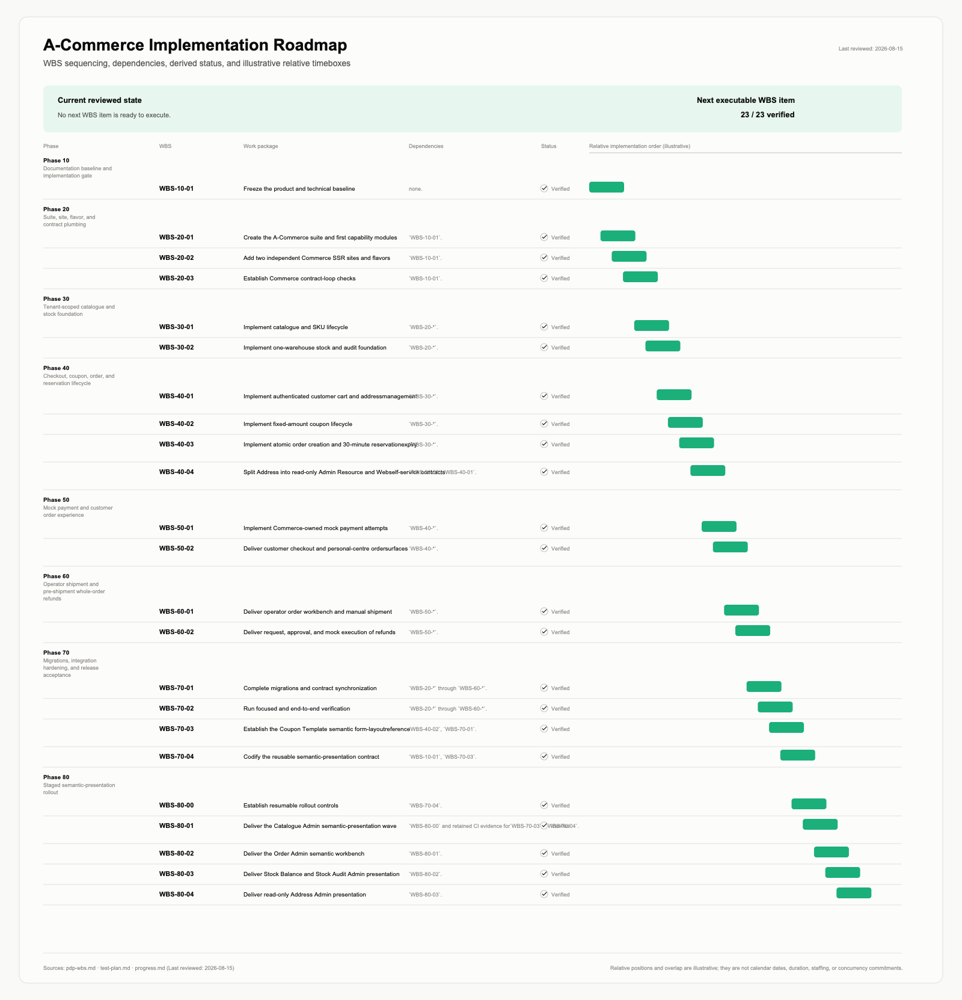
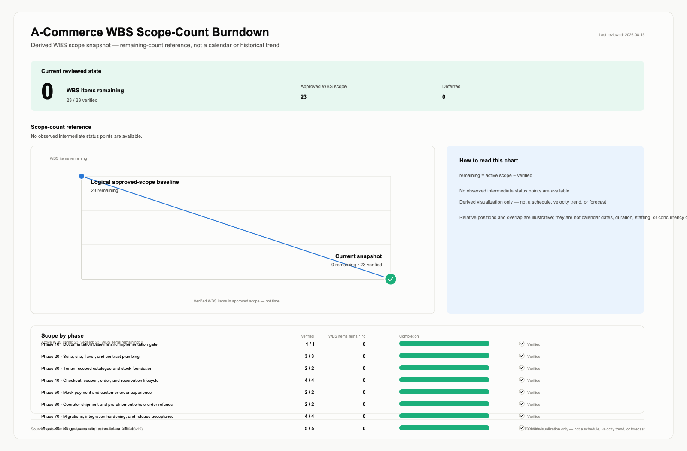

# CabloyJS AI Spec-Driven Development Automatically Generates Gantt and Burndown Charts

The easiest way to start AI coding is to describe a page or an API in a chat window. But once a project has multiple modules, multiple audiences, and an evolving frontend-backend contract, the genuinely difficult questions become: where does this change belong? Which boundaries have already been confirmed? How can we prove that it is actually complete?

CabloyJS includes two complementary Claude Code Skills that divide the work into two phases: first establish specification authority inside the repository, then execute a bounded delivery increment. This article introduces the two Skills, explains the Spec files they produce and consume, and uses real charts from the built-in `a-commerce` suite to show the result.

## Meet the two Skills first

The two Skills are invoked as follows:

- `cabloy-spec-generation`: creates or maintains the suite planning records under `repo-specs/<suite>/`, establishing traceability among product, technical, delivery, and acceptance concerns.
- `cabloy-spec-execution`: works from an existing specification to execute one explicit `WBS-*` item—or a finite, approved phase with a closed boundary—and records the actual verification results.

The following table summarizes the difference:

| Dimension           | `cabloy-spec-generation`                                                                        | `cabloy-spec-execution`                                                                                        |
| ------------------- | ----------------------------------------------------------------------------------------------- | -------------------------------------------------------------------------------------------------------------- |
| Problem addressed   | What should be built, and how should boundaries and acceptance be recorded?                     | How should one approved item be implemented and proven complete?                                               |
| Input               | A new suite description or a request to maintain an existing specification                      | An explicit `WBS-*` item, or a finite and approved phase                                                       |
| Primary outputs     | PRD, SRS, PDP/WBS, ATP, ADRs, derived status, and charts                                        | Source changes, test results, Evidence, derived progress, and charts                                           |
| Confirmation gate   | Confirms identity, scope, topology, site strategy, and more before planning records are written | Confirms the execution dossier, dependencies, scope, commands, and evidence requirements before implementation |
| What it does not do | Does not write business source code or treat planning as implementation                         | Does not invent requirements, replace specification generation, or automatically expand into adjacent tasks    |

### 1. Establish a specification baseline with generation

In Claude Code, begin with a business description:

```text
/cabloy-spec-generation Plan an equipment-maintenance suite for field technicians and operations managers: include equipment records, work orders, asset history, role-based access control, and an Admin dashboard.
```

The Skill first performs read-only discovery and asks for missing inputs. Its typical steps are:

1. inspect the repository root, `package.json`, `CLAUDE.md`, and the edition marker;
2. distinguish a new suite from an extension of an existing suite, and check whether `repo-specs/<suite>/` already exists;
3. independently evaluate whether Web and Admin should reuse an existing site or use a dedicated site;
4. collect product goals, roles, scope, module topology, tenancy and authorization, states, transactions, verification, and release constraints;
5. show a generation confirmation gate before writing planning records;
6. generate files in authority order, run exact-ID traceability checks, and produce two derived charts.

### 2. Execute a bounded increment with execution

Once the specification is ready and a task’s dependencies are satisfied, invoke execution:

```text
/cabloy-spec-execution WBS-40-03
```

`WBS-40-03` is only an example. A real project should use an ID that actually exists in the target suite. The AI then follows this process:

1. read `README.md`, the PRD, SRS, applicable ADRs, the complete WBS, ATP/test plan, progress, Evidence, and derived charts;
2. check the edition, current revision, workspace state, dependencies, blockers, unresolved `TODO`s, and whether previous evidence is still valid;
3. prepare an execution dossier listing the objective, scope, exclusions, authority IDs, source ownership, specialist-Skill routing, verification commands, and evidence format;
4. obtain explicit confirmation before routing into backend, frontend, or Contract Loop specialist workflows;
5. run the narrowest meaningful check first, followed by the ATP-required verification;
6. save Evidence containing the revision, environment, steps, results, and locations of sanitized artifacts;
7. update derived `progress.md`, regenerate and check the charts, and leave one unambiguous next action.

```text
/cabloy-spec-execution Execute the next task in the equipment-maintenance suite
```

If the next incremental WBS ID is unknown, ask the AI to first read the suite’s `progress.md` and combine it with the WBS, ATP, and existing Evidence to list executable `WBS-*` IDs whose dependencies are satisfied. The user can then confirm the specific item to execute next.

## What generation produces: a connected set of Spec files

For a long-lived business suite, the default core output of `cabloy-spec-generation` is located at:

```text
repo-specs/<suite>/
├── README.md
├── prd.md
├── srs.md
├── pdp-wbs.md
├── test-plan.md
├── progress.md
├── implementation-gantt.svg
├── implementation-burndown.svg
└── decisions/
    └── 0001-<suite-boundary-slug>.md
```

This is not simply one large document split into several files. It is a model of **separated authority**: each record owns one kind of fact, while the others refer to it through stable IDs and links.

| File                          | Facts it owns                                                                                                                                                          | What it should not replace                                      |
| ----------------------------- | ---------------------------------------------------------------------------------------------------------------------------------------------------------------------- | --------------------------------------------------------------- |
| `README.md`                   | Index, reading order, suite baseline, topology summary, and authority map                                                                                              | Detailed PRD, SRS, or WBS content                               |
| `prd.md`                      | Product goals, roles, scope, journeys, business rules, product requirements, and product acceptance                                                                    | Table names, DTO syntax, routes, or test commands               |
| `srs.md`                      | Technical contracts; data and capability ownership; tenancy; identity; authorization; states; transactions; concurrency; APIs/DTOs; SSR; and non-functional boundaries | API authority or authorization determined by a UI layout        |
| `pdp-wbs.md`                  | Delivery phases, WBS tasks, dependencies, completion checks, and delivery traceability                                                                                 | Upstream product requirements or technical contracts            |
| `test-plan.md`                | ATP acceptance scenarios, test levels, fixtures, verification procedures, Evidence format, and release gates                                                           | Planned commands presented as results that have already passed  |
| `progress.md`                 | WBS state, blockers, Evidence pointers, decisions, and the next proof                                                                                                  | Requirements, contracts, or acceptance rules                    |
| `decisions/*.md`              | Long-lived scope, architecture, security, ownership, or integration decisions                                                                                          | A duplicate SRS or status log                                   |
| `implementation-gantt.svg`    | A WBS-derived view of phases, task order, dependencies, and status                                                                                                     | Planning authority, date commitments, or duration commitments   |
| `implementation-burndown.svg` | A scope-and-status-derived count of remaining items                                                                                                                    | A velocity trend or forecast when no historical snapshots exist |

## From business intent to evidence: how the files connect

The core traceability chain is:

```text
PRD requirement
      ↓
SRS contract
      ↓
PDP/WBS task
      ↓
ATP scenario
      ↓
observed Evidence
```

It can also be written more compactly:

```text
PRD → SRS → WBS → ATP → Evidence
```

For example, a product requirement that “an authorized operator can view orders in the current tenant” must be made concrete in the SRS as identity, tenancy, authorization, data ownership, and API contracts. The WBS then defines the implementation boundary and dependencies; the ATP provides executable happy-path, unauthorized, and cross-tenant scenarios; finally, the actual runtime observations are saved as sanitized evidence.

When a task is executed, the document-state update order is:

```text
Upstream authority changes
  → traceability matrix
  → WBS dependencies and completion checks
  → ATP procedures and expected Evidence
  → progress / Evidence
  → two derived charts
```

`progress.md` and both SVGs are downstream derived outputs. They help people and AI understand the current state quickly.

## How to read the two charts

The charts are automatically generated by built-in scripts from `pdp-wbs.md`, `test-plan.md`, and `progress.md`.

### Gantt: inspect delivery order, not a calendar schedule

The Gantt chart reads the formal phases, WBS tasks, dependencies, and progress statuses. It is useful for answering: what delivery packages exist? What is their approximate order? Which tasks depend on preceding phases?

The current chart for the built-in `a-commerce` suite contains 23 formal WBS tasks, all shown as 23/23 `verified`.



### Burndown: inspect scope counts, not velocity forecasts

In the current `a-commerce` snapshot, the Burndown chart shows 23 active WBS items, 23 `verified`, 0 remaining, and 0 deferred.



## When this approach is worthwhile

This approach is best suited to enterprise systems that evolve over time, span modules, involve multiple collaborators, and include both Vona backend and Zova Admin/Web/SSR work—especially where tenancy, authorization, transactions, concurrency, auditability, or external integrations are important.

For a one-off page, a simple website, or a very small utility, a lightweight prompt-to-code workflow may be more economical.

## Start with a small increment

Choose one clearly bounded capability rather than trying to plan an entire system at once:

1. Use generation to plan the requirement.
   - Record goals, scope, and exclusions.
   - Confirm technical contracts, ownership, dependencies, and ATP.
2. Use execution to deliver one WBS ID.
   - Run applicable verification and save sanitized Evidence.
   - Update progress and the derived charts.
3. Proceed to the next increment.

Create a Cabloy project from the public scaffolding:

```bash
npm create cabloy
npm run dev
npm run dev:zova:admin
npm run dev:zova:web
```

## Conclusion

AI Spec-Driven Development in CabloyJS is not another way of saying “prompts become code.” It is a more concrete delivery path:

```text
Business intent → specification authority → bounded WBS → acceptance procedure → observed Evidence
```

`cabloy-spec-generation` organizes intent into a traceable planning chain. `cabloy-spec-execution` advances one increment within confirmed boundaries. Together, they reduce the AI’s need to guess about business scope, technical ownership, and the definition of done.

## Further reading

- [AI Spec-Driven Development](https://cabloy.com/ai/ai-spec-driven-development)
- [Generate a Cabloy Suite Specification](https://cabloy.com/ai/playbook-spec-generation)
- [Execute an Approved Cabloy Specification Increment](https://cabloy.com/ai/playbook-spec-execution)
- [Verification](https://cabloy.com/ai/verification)
- [Contract Loop Playbook](https://cabloy.com/fullstack/contract-loop-playbook)
- [Vona + Zova Integration](https://cabloy.com/fullstack/vona-zova-integration)
- [Cabloy Fullstack Quick Start Tutorials](https://cabloy.com/fullstack/tutorials-overview)
