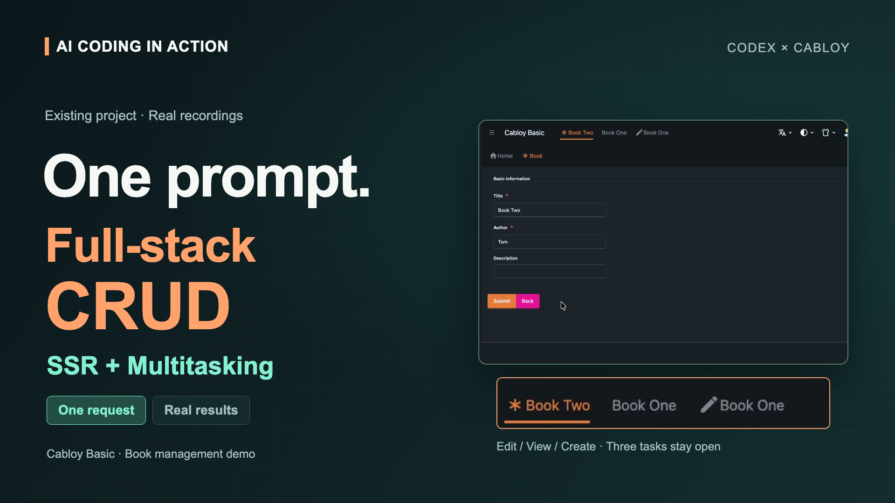

## Demonstrations(Videos)

### 1. AI Coding in Action: One Prompt for CRUD, SSR & Multitasking (Duration: 3:50)

## Choose a reading path

### Start a project

1. [Choose an edition](/editions/overview#choosing-an-edition)
2. [Fullstack Quickstart](/fullstack/quickstart)
3. [Fullstack Quick Start Tutorials](/fullstack/tutorials-overview)

### Develop across Vona and Zova

Use the contract loop when generated contracts or metadata cross the Vona-Zova boundary.

1. [Fullstack Introduction](/fullstack/introduction)
2. [Fullstack CLI](/fullstack/cli)
3. [Contract Loop Playbook](/fullstack/contract-loop-playbook)

### Deliver from confirmed specs

Use AI Spec-Driven Development to connect product intent, bounded work, and acceptance evidence.

1. [AI Spec-Driven Development](/ai/ai-spec-driven-development)
2. [AI Development Introduction](/ai/introduction)

### Explore performance

1. [Framework Performance](/fullstack/framework-performance)
2. [Cache Guide](/backend/cache-guide)

## Documentation scope labels

Use these labels throughout the site:

- <Badge type="tip" text="Common" /> applies to both Cabloy Basic and Cabloy Start.
- <Badge type="info" text="Basic" /> applies only to Cabloy Basic.
- <Badge type="warning" text="Start" /> applies only to Cabloy Start.
