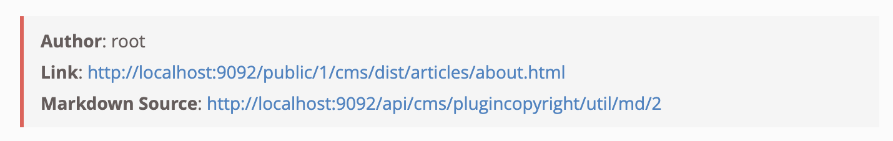
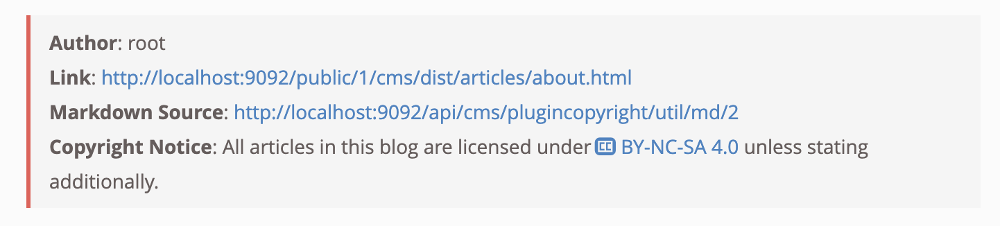
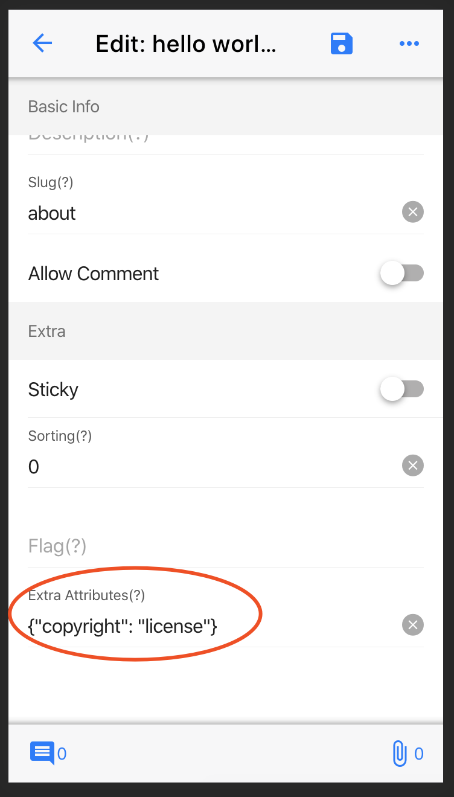

English | [简体中文](./README.zh-CN.md)

# egg-born-module-cms-plugincopyright

## Introduce

Use this plugin to automatically display the `copyright notice` and basic information of the article at the bottom of the article, such as author, link and markdown source, etc.

## How to Use

### Install

``` bash
$ npm i egg-born-module-cms-plugincopyright
```

> If the theme module already contains this plugin, it will be installed automatically

### Configuration

Modify the plugin parameters in the `site configuration` or `Language Configuration`

This plugin provides three display styles: `none/simple/license`, while `simple` is the default style

``` javascript
{
  ...
  "plugins": {
    "cms-plugincopyright": {
      "default": "simple"
    }
  }
}
```

#### 1. none

Display nothing

#### 2. simple



#### 3. license



### Article Parameters

We can also set the display style for the article separately


