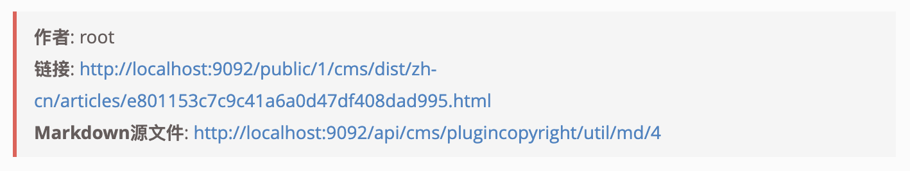
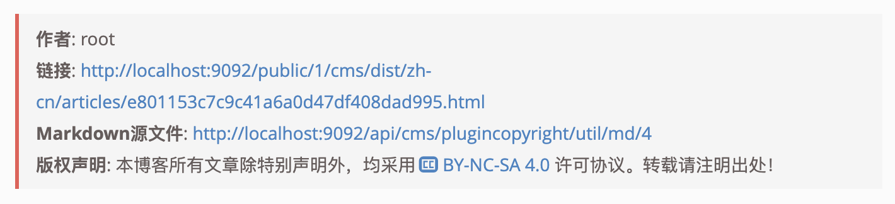
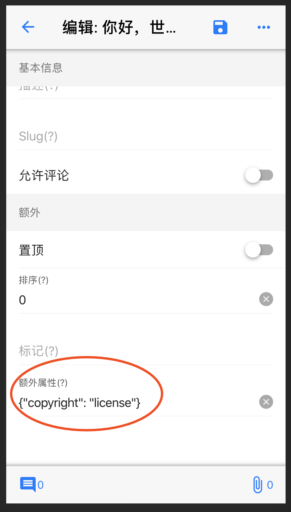

简体中文 | [English](./README.md)

# egg-born-module-cms-plugincopyright

## 介绍

使用此插件可以自动在文章底部显示`版权声明`及文章基本信息，如作者、链接和Markdown源文件，等等

## 如何使用

### 安装插件

``` bash
$ npm i egg-born-module-cms-plugincopyright
```

> 如果主题模块已经包含了此插件就会自动安装

### 配置参数

在`站点配置`或`语言配置`中修改插件的参数即可

此插件提供了三种显示风格：`none/simple/license`, 其中`simple`是默认风格

``` javascript
{
  ...
  "plugins": {
    "cms-plugincopyright": {
      "default": "simple"
    }
  }
}
```

#### 1. none

不显示任何内容

#### 2. simple



#### 3. license



### 文章参数

我们也可以单独给文章设置显示风格


